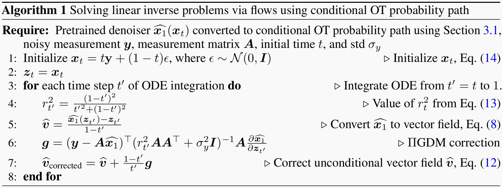
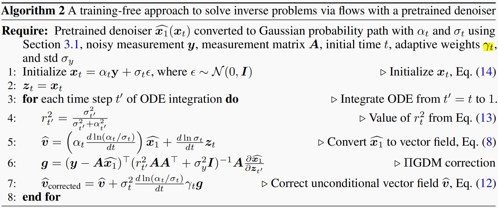
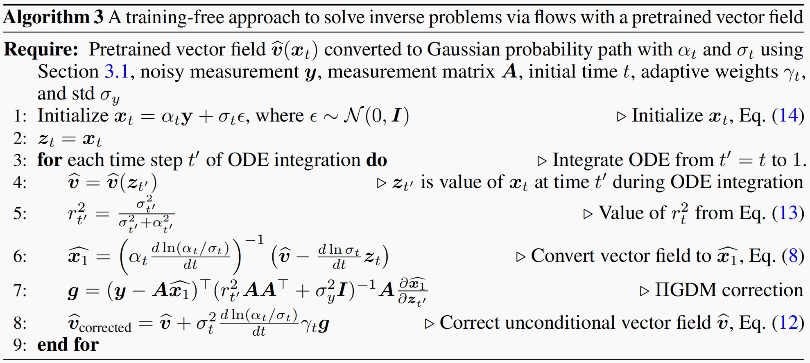

# 引导和可控生成

## 分类
### Classifier Guidance

### Classifier-Free Guidance

### Training-Free Guidance

$$
\begin{equation*}
\nabla_{\mathbf{x}_t} \log p_t(\mathbf{x}_t | \mathbf{y}) = \nabla_{\mathbf{x}_t} \log p_t(\mathbf{x}_t) + \nabla_{\mathbf{x}_t} \log p_t(\mathbf{y} | \mathbf{x}_t)
\end{equation*}
$$

## Score ALD
 

## ILVR
 [Conditioning Method for Denoising Diffusion Probabilistic Models)(http://arxiv.org/pdf/2108.02938)核心思想是利用一个低通滤波器将参考图像的结构信息作为条件，引导扩散模型的生成过程，而无需重新训练模型。如果生成的图像与参考图像在低频成分上一致，那么它们在整体结构上就会相似。高频细节则可以自由生成，实现多样性。

\[
q(\mathbf{x}_t | \mathbf{x}_{t-1}) := \mathcal{N}(\mathbf{x}_t; \sqrt{1 - \beta_t} \mathbf{x}_{t-1}, \beta_t \mathbf{I}),
\]

\[
q(x_t \vert x_0) := N(x_t; \sqrt{\alpha_t} x_0, (1 - \bar{\alpha}_t)\mathbf{I}),
\]

\[
x_t = \sqrt{\alpha_t} x_0 + \sqrt{1 - \alpha_t} \epsilon
\]

\[
p_\theta(x_{t-1}|x_t) = N(x_{t-1}; \mu_\theta(x_t, t), \sigma_t^2 \mathbf{I}).
\]

\[
x_{t-1} = \frac{1}{\sqrt{\alpha_t}} \left( x_t - \frac{1 - \alpha_t}{\sqrt{1 - \alpha_t}} \epsilon_\theta(x_t, t) \right) + \sigma_t \mathbf{z},
\]

\[
\begin{align*}
p_{\theta}(x_0|c) &= \int p_{\theta}(x_{0:T}|c)dx_{1:T}, \\
p_{\theta}(x_{0:T}|c) &= p(x_T) \prod_{t=1}^{T} p_{\theta}(x_{t-1}|x_t, c).
\end{align*}
\]

\[
p_\theta(x_{t-1}|x_t, c) \approx p_\theta(x_{t-1}|x_t, \phi_N(x_{t-1}) = \phi_N(y_{t-1}))
\]

\[
\begin{align*} x'_{t-1} &\sim p_{\theta}(x'_{t-1}|x_t), \\ x_{t-1} &= \phi(y_{t-1}) + (I - \phi)(x'_{t-1}). \end{align*}
\]

\[
Y = \{ y : \phi_N(y) = \phi_N(x), x \in \mu \},
\]

\[
R_N \subset R_M \subset \mu,
\]

## RED-Diff
 [A VARIATIONAL PERSPECTIVE ON SOLVING INVERSE PROBLEMS WITH DIFFUSION MODELS](https://arxiv.org/pdf/2305.04391) 暂时没有看懂

## Denoising Diffusion Null Models (DDNM)

## Denoising Diffusion Restoration Models (DDRM)

## ΠGDM
 [Pseudoinverse-guided diffusion models for inverse problems](https://jankautz.com/publications/PiGDM_ICLR23.pdf)  

 假设我们拥有对某个信号 \( x_0 \in \mathbb{R}^n \) 的测量值 \( y \in \mathbb{R}^m \)，其关系为  
\[y = Hx_0 + z, \tag{2}\]

其中 \( H \in \mathbb{R}^{n \times m} \) 是已知的测量矩阵，\( z \sim \mathcal{N}(0, \sigma_y^2 I) \) 是一个独立同分布的高斯噪声向量，其各维度上的标准差 \( \sigma_y \) 已知。  
 我们的目标是求解这个逆问题，从测量值 \( y \) 中恢复出原始信号 \( x_0 \in \mathbb{R}^n \)。

$p_t(\mathbf{x}_0 \vert \mathbf{x}_t)$使用高斯近似(ΠGDM的关键近似):  
\[
p_t(\mathbf{x}_0|\mathbf{x}_t) \approx \mathcal{N}(\hat{\mathbf{x}}_t, r_t^2 \mathbf{I}), \tag 4
\]
均值使用Tweedie公式估计:  
$$
\begin{equation*}
\hat{\mathbf{x}}_t = \mathbb{E}[\mathbf{x}_0 | \mathbf{x}_t] = \mathbf{x}_t + \sigma_t^2 \nabla_{\mathbf{x}_t} \log p_t(\mathbf{x}_t) \approx \mathbf{x}_t + \sigma_t^2 S_\theta(\mathbf{x}; \sigma_t).  \tag 5
\end{equation*}
$$  

 其中$p_t(\mathbf{x}_t \vert \mathbf{x}_0) \sim \mathcal{N}({\mathbf{x}}_0, \sigma_t^2 \mathbf{I})$,注意:$r_t$与$\sigma_t$不同  
 显然$p_t(\mathbf{y} \vert \mathbf{x}_t)$也是高斯分布:  
\[
p_t(\mathbf{y} | \mathbf{x}_t) \approx \mathcal{N}(\mathbf{H}\hat{\mathbf{x}}_t, r_t^2 \mathbf{H}\mathbf{H}^\top + \sigma_y^2 \mathbf{I}).
\]  
 可以推导出$p_t(\mathbf{y} \vert \mathbf{x}_t)$的得分:  
$$
\begin{align*}
\log p_t(\mathbf{y}|\mathbf{x}_t) &= -\frac{1}{2} (\mathbf{y} - H\hat{\mathbf{x}}_t)^\top \Sigma_t^{-1} (\mathbf{y} - H\hat{\mathbf{x}}_t) + \text{const} \quad // \text{取对数，忽略常数项} \\
\nabla_{\mathbf{x}_t} \log p_t(\mathbf{y}|\mathbf{x}_t) &= -\frac{1}{2} \nabla_{\mathbf{x}_t} ((\mathbf{y} - H\hat{\mathbf{x}}_t )^\top \Sigma_t^{-1} (\mathbf{y} - H\hat{\mathbf{x}}_t )) \quad // \text{记协方差为}\Sigma_t \\
&= - (\frac{\partial {(\mathbf{y} - H\hat{\mathbf{x}}_t})}{\partial \mathbf{x}_t} )^\top \Sigma_t^{-1} ({\mathbf{y} - H\hat{\mathbf{x}}_t}) \\
&= (H \frac{\partial \hat{\mathbf{x}}_t}{\partial \mathbf{x}_t})^\top \Sigma_t^{-1} ({\mathbf{y} - H\hat{\mathbf{x}}_t}) \quad //链式法则 \\
&= (H \frac{\partial \hat{\mathbf{x}}_t}{\partial \mathbf{x}_t})^\top (r_t^2 HH^\top + \sigma_y^2 I)^{-1} ({\mathbf{y} - H\hat{\mathbf{x}}_t}) \quad //带入\Sigma_t \\
&= \left(\underbrace{(\mathbf{y} - H\mathbf{\hat{x}}_t)^\top (r_t^2 HH^\top + \sigma_y^2 I)^{-1} H}_{\text{vector}} \underbrace{\left(\frac{\partial \mathbf{\hat{x}}_t}{\partial \mathbf{x}_t}\right)}_{\text{Jacobian}}\right)^\top \quad //\Sigma_t是对称矩阵  \tag 7
\end{align*}
$$  

当$\sigma_y=0$时(无噪声测量),公式7可以近似为:  

$$
\begin{align*}
\nabla_{\mathbf{x}_t} \log p_t(\mathbf{y}|\mathbf{x}_t) &\approx \left(\underbrace{(\mathbf{y} - H\mathbf{\hat{x}}_t)^\top (r_t^2 HH^\top)^{-1} H}_{\text{vector}} \underbrace{\left(\frac{\partial \mathbf{\hat{x}}_t}{\partial \mathbf{x}_t}\right)}_{\text{Jacobian}}\right)^\top\\ 
&= r_t^{-2} \left(\underbrace{(\mathbf{y} - H\mathbf{\hat{x}}_t)^\top (HH^\top)^{-1} H}_{\text{vector}} \underbrace{\left(\frac{\partial \mathbf{\hat{x}}_t}{\partial \mathbf{x}_t}\right)}_{\text{Jacobian}}\right)^\top\\
&= r_t^{-2} \left(\underbrace{(\mathbf{y} - H\mathbf{\hat{x}}_t)^\top (H^\dagger)^\top}_{\text{vector}} \underbrace{\left(\frac{\partial \mathbf{\hat{x}}_t}{\partial \mathbf{x}_t}\right)}_{\text{Jacobian}}\right)^\top \quad //H^\dagger = H^\top(HH^\top)^{-1}\\
&=r_t^{-2} \left(\left(\mathbf{H}^\dagger \mathbf{y} - \mathbf{H}^\dagger \mathbf{H} \mathbf{\hat{x}}_t\right)^\top \frac{\partial \mathbf{\hat{x}}_t}{\partial \mathbf{x}_t}\right)^\top  \tag 8
\end{align*}
$$  

 其中: $H^\dagger = H^\top(HH^\top)^{-1}$ 是矩阵H的Moore-Penrose伪逆。

## DPS
 [Diffusion posterior sampling for general noisy inverse problems](https://arxiv.org/pdf/2209.14687)提出了一种名为“扩散后验采样 (Diffusion Posterior Sampling, DPS)”的新方法，旨在高效且稳健地解决各种带有测量噪声的线性及非线性逆问题。传统扩散模型在逆问题求解中通常面临两大挑战：一是难以处理测量噪声(伪逆引导就是无噪声版本)，二是对非线性正向模型支持不足。DPS 方法通过对后验采样进行创新性近似，有效地克服了这些限制。

DDPM前向过程的SDE方程表达式如下:
\[
dx = - \frac{\beta(t)}{2} x dt + \sqrt{\beta(t)} dw \tag 1
\]

根据Reverse-SDE其对应的采样过程SDE为:  
\[
dx = \left[ -\frac{\beta(t)}{2} \boldsymbol{x} - \beta(t)\nabla_{\boldsymbol{x}_t} \log p_t(\boldsymbol{x}_t) \right] dt + \sqrt{\beta(t)} d\bar{\boldsymbol{w}} \tag 2
\]
可以看出漂移项仅依赖得分函数,可以训练一个去噪得分匹配(Noise Conditional ScoreNetwork)近似,训练的目标如下:
\[
\theta^* = \underset{\theta}{\arg\min} \, \mathbb{E}_{t \sim U(\varepsilon, 1), \boldsymbol{x}(t) \sim p(\boldsymbol{x}(t) | \boldsymbol{x}(0)), \boldsymbol{x}(0) \sim p_{\text{data}}} \left[ \left\| s_\theta(\boldsymbol{x}(t), t) - \nabla_{\boldsymbol{x}_t} \log p(\boldsymbol{x}(t) | \boldsymbol{x}(0)) \right\|_2^2 \right] \tag 3
\]

对于带条件的采样,根据贝叶斯原理可以将$p(x)$作为先验，从后验$p(x\vert y)$采样，则条件采样下公式2变为:  
\[
dx = \left[ -\frac{\beta(t)}{2}\mathbf{x} - \beta(t)\left(\nabla_{\mathbf{x}_t}\log p_t(\mathbf{x}_t) + \nabla_{\mathbf{x}_t}\log p_t(\mathbf{y}|\mathbf{x}_t)\right) \right] dt + \sqrt{\beta(t)}d\bar{w}, \tag 4
\]
其中:
\[
\nabla_{x_t} \log p_t(x_t | \mathbf{y}) = \nabla_{x_t} \log p_t(x_t) + \nabla_{x_t} \log p_t(\mathbf{y} | x_t). \tag 5
\]
后一项(引导梯度)难以获得解析解，由于其依赖时间t,且y和$x_t$没有显示依赖。

一般地带噪测量y与样本$x_0$有如下公式表示:
\[
\boldsymbol{y} = \boldsymbol{\mathcal{A}}(\boldsymbol{x}_0) + \boldsymbol{n}, \quad \boldsymbol{y}, \boldsymbol{n} \in \mathbb{R}^n, \quad \boldsymbol{x}_0 \in \mathbb{R}^d 
\tag 6
\]
 其中$\boldsymbol{\mathcal{A}}$为前向测量操作算子,$\boldsymbol{n}$为测量噪声。

后验分布$p(y \vert x_t)$可以分解为:
$$
\begin{align*}
p(\mathbf{y}|\mathbf{x}_t) &= \int p(\mathbf{y}|\mathbf{x}_0, \mathbf{x}_t)p(\mathbf{x}_0|\mathbf{x}_t)d\mathbf{x}_0 \\
&= \int p(\mathbf{y}|\mathbf{x}_0)p(\mathbf{x}_0|\mathbf{x}_t)d\mathbf{x}_0 \tag 7
\end{align*}
$$
可以看出$p(\mathbf{x}_0 \vert \mathbf{x}_t)$通常难以获取。 

对于DDPM其$x_t$与$x_0$的关系如下:
\[
x_t = \sqrt{\bar{\alpha}(t)} x_0 + \sqrt{1 - \bar{\alpha}(t)} z, \quad z \sim \mathcal{N}(0, I), \tag 8
\]
命题1: 对于VP-SDE或DDPM采样，$p(x_0|x_t)$在存在唯一的后验均值：
\[
\hat{\boldsymbol{x}}_0 := \mathbb{E}[\boldsymbol{x}_0 | \boldsymbol{x}_t] = \frac{1}{\sqrt{\bar{\alpha}(t)}} \left( \boldsymbol{x}_t + (1 - \bar{\alpha}(t)) \nabla_{\boldsymbol{x}_t} \log p_t(\boldsymbol{x}_t) \right)  \tag 9
\]
可以近似表示为：
\[
\hat{\mathbf{x}}_0 \approx \frac{1}{\sqrt{\bar{\alpha}(t)}} \left(\mathbf{x}_t + (1 - \bar{\alpha}(t))\mathbf{s}_{\theta^{*}}(\mathbf{x}_t, t)\right).  \tag {10}
\]
### DPS核心近似
 既然$p(\mathbf{y} \vert \mathbf{x}_t)$难以计算,由公式7可知$p(\mathbf{y} \vert \mathbf{x}_t)=\mathbb{E}_{\mathbf{x}_0 \sim p(\mathbf{x}_0|\mathbf{x}_t)}[p(\mathbf{y} \vert \mathbf{x}_0)]$, 那么用$p(\mathbf{y} \vert \hat{\mathbf{x}}_0)$来近似。
\[
p(\mathbf{y}|\mathbf{x}_t) \simeq p(\mathbf{y}|\hat{\mathbf{x}}_0), \text{ where } \hat{\mathbf{x}}_0 := \mathbb{E}[\mathbf{x}_0|\mathbf{x}_t] = \mathbb{E}_{\mathbf{x}_0 \sim p(\mathbf{x}_0|\mathbf{x}_t)}[\mathbf{x}_0]  \tag {11}
\]
其近似误差可用Jensen gap来度量：
\[
\mathcal{J}(f, x \sim p(x)) = \mathbb{E}[f(x)] - f(\mathbb{E}[x]), \tag {12}
\]
定理1: 对于公式6定义的测量,其中$\mathbf{n} \sim \mathcal{N}(0, \sigma^{2} \mathbf{I})$，我们近似：
\[
p(\mathbf{y}|\mathbf{x}_t) \simeq p(\mathbf{y}|\hat{\mathbf{x}}_0), \tag {13}
\]
则其Jensen gap的上界为:
\[
\mathcal{J} \leq \frac{d}{\sqrt{2\pi\sigma^2}} e^{-1/2\sigma^2} \|\nabla_x \mathcal{A}(\boldsymbol{x})\|{m_1}  \tag {14}
\]
其中：$ \| \nabla_x \mathcal{A}(\boldsymbol{x}) := \max_{\boldsymbol{x}} \| \nabla_x \mathcal{A}(\boldsymbol{x}) \| \text{ and } m_1 := f \| x_0 - \hat x_0 \| p(x_0 \vert x_t)  d x_0$。由公式14可知，测量噪声$\sigma$越大近似误差越小,因此DPS对于噪声类的逆问题效果很好。  
 由公式13概率分布近似，可以导出它们梯度也近似:
\[
\nabla_{x_t} \log p(\mathbf{y} | x_t) \simeq \nabla_{x_t} \log p(\mathbf{y} | \hat{x}_0), \tag {15}
\]
 对于高斯测量噪声：
\[
p(\mathbf{y}|\mathbf{x}_0) = \frac{1}{\sqrt{(2\pi)^n \sigma^{2n}}} \exp \left[ - \frac{\|\mathbf{y} - \mathcal{A}(\mathbf{x}_0)\|_2^2}{2\sigma^2} \right],
\]
 根据定理1和公式15有:
\[
\nabla_{\mathbf{x}_t} \log p(\mathbf{y}|\mathbf{x}_t) \simeq - \frac{1}{\sigma^2} \nabla_{\mathbf{x}_t} \left\| \mathbf{y} - \mathcal{A}(\hat{\mathbf{x}}_0(\mathbf{x}_t)) \right\|_2^2
\]  
 代入公式5有：
\[
\nabla_{x_t} \log p_t(\mathbf{x}_t | \mathbf{y}) \simeq s_{\theta*}(\mathbf{x}_t, t) - \rho \nabla_{x_t} \|\mathbf{y} - A(\hat{\mathbf{x}}_0)\|_2^2
\]

其中:$ρ = 1/\sigma^2$ 可当作步长。

## CCDF
 [Come-Closer-Diffuse-Faster: Accelerating Conditional Diffusion Models for Inverse Problems through Stochastic Contraction](https://arxiv.org/pdf/2112.05146)  

\[
dx = \bar{\mathbf{f}}(x, t) dt + \bar{\mathbf{g}}(t) dw,
\]

\[
dx = \left[ \bar{\mathbf{f}}(\mathbf{x}, t) - \bar{g}(t)^2 \underbrace{\nabla_x \log p_t(\mathbf{x})}_{\text{score function}} \right] dt + \bar{g}(t) d\bar{w}
\]

\[
\bar{\boldsymbol{f}}(\boldsymbol{x},t) = -\frac{1}{2}\beta(t)\boldsymbol{x}, \quad \bar{g}(t) = \sqrt{\beta(t)},
\]

\[
\boldsymbol{x}_i = \sqrt{\bar{\alpha}_i} \boldsymbol{x}_0 + \sqrt{1 - \bar{\alpha}_i} \boldsymbol{z}
\]

\[
\mathbf{x}_{i-1} = \frac{1}{\sqrt{\alpha_i}} \left( \mathbf{x}_i + (1 - \alpha_i)\mathbf{s}_{\theta}(\mathbf{x}_i, i) \right) + \sqrt{\sigma_i}\mathbf{z},
\]

\[
\mathbf{x}_{i-1} = \sqrt{\bar{\alpha}_{i-1}} \left( \frac{\mathbf{x}_i - \sqrt{1 - \bar{\alpha}_i} \mathbf{z}_\theta(\mathbf{x}_i, i)}{\sqrt{\bar{\alpha}_i}} \right) + \sqrt{1 - \bar{\alpha}_{i-1}} \mathbf{z}_\theta(\mathbf{x}_i, i)
\]

\[
\boldsymbol{z}_{\theta}(x, i) := -\boldsymbol{s}_{\theta}(x, i)\sqrt{1 - \bar{\alpha}_i}.
\]

\[
x'_{i-1} = \boldsymbol{f}(x_i, i) + \boldsymbol{g}(x_i, i)z_i
\]

\[
x_{i-1} = \boldsymbol{A}x'_{i-1} + \boldsymbol{b}
\]

\[
\| \boldsymbol{A}\boldsymbol{x} - \boldsymbol{A}\boldsymbol{x}' \| \le \| \boldsymbol{x} - \boldsymbol{x}' \|, \quad \forall \boldsymbol{x}, \boldsymbol{x}'
\]

\[
\bar{\varepsilon}_{N'} := \mathbb{E} \| \mathbf{x}_{N'} - \tilde{\mathbf{x}}_{N'} \|^2 = a^2_{N'} \varepsilon_0 + 2 b^2_{N'} n.
\]

\[
\bar{\varepsilon}_{0,r} \leq \frac{2C\tau}{1-\lambda^2} + \lambda^{2N'} \bar{\varepsilon}_{N'}
\]

\[
\lambda = \begin{cases}
    \max_{i \in [N']} \sqrt{\alpha_i} \left( \frac{1 - \bar{\alpha}_{i-1}}{1 - \bar{\alpha}_i} \right) & \text{(DDPM)} \\
    \max_{i \in [N']} \frac{\sigma_{i-1}^2 - \sigma_0^2}{\sigma_i^2 - \sigma_0^2} & \text{(SMLD)} \\
    \max_{i \in [N']} \frac{\sigma_{i-1}}{\sigma_i} & \text{(DDIM)}
\end{cases}
\]

\[
C = \begin{cases}
n(1 - \alpha_N) & (\text{DDPM}) \\
n \max_{i \in [N']} \sigma_i^2 - \sigma_{i-1}^2 & (\text{SMLD}) \\
0 & (\text{DDIM})
\end{cases}
\]

## TRAINING-FREE LINEAR IMAGE INVERSES VIA FLOWS
 [TRAINING-FREE LINEAR IMAGE INVERSES VIA FLOWS](http://arxiv.org/pdf/2310.04432)
 将TRAINING-FREE的引导生成从扩散模型引入流匹配模型，并提出一种基于条件最优传输(OT)路径的求解器方案。无需重新训练可适用到现有的扩散模型中。

高斯概率路径:
\[
q(\mathbf{x}_t|\mathbf{y}, \mathbf{x}_1) = q(\mathbf{x}_t|\mathbf{x}_1) = \mathcal{N}(\alpha_t \mathbf{x}_1, \sigma_t^2 \mathbf{I}) \tag 5
\]  
 其中$x_0为纯噪声,x_1为数据分布,对于OT概率路径有: \alpha_t=1-t,\sigma_t=t$。

测量值y定义如下:
\[
y = Ax_1 + \epsilon \quad //其中\epsilon \sim \mathcal{N}(0,\sigma_y^2\mathbf{I})  \tag 7
\]

### 得分引导到速度场引导
 由[An Introduction to Flow Matching and Diffusion Models](https://diffusion.csail.mit.edu/docs/lecture-notes.pdf)的公式54可知速度场和得分存在如下关系
$$
\begin{equation*}
u_t(x) =\beta_t^2  \frac {d ln(\frac {\alpha_t} {\beta_t})} {dt}   s_t (x) + \frac {d ln(\alpha_t)} {dt} x  
\end{equation*}
$$  
将变量表示替换为本文的有:  
$$
\begin{equation*}
v(\mathbf{x}_t) =\sigma_t^2  \frac {d ln(\frac {\alpha_t} {\sigma_t})} {dt}   \nabla_{\mathbf{x}_t} \ln q(\mathbf{x_t}) + \frac {d ln(\alpha_t)} {dt} \mathbf{x}_t  
\end{equation*}
$$
响应的条件速度场和条件得分的关系如下:
$$
\begin{equation*}
v(\mathbf{x}_t,\mathbf{y}) =\sigma_t^2  \frac {d ln(\frac {\alpha_t} {\sigma_t})} {dt}   \nabla_{\mathbf{x}_t} \ln q(\mathbf{x_t}|\mathbf{y}) + \frac {d ln(\alpha_t)} {dt} \mathbf{x}_t  
\end{equation*}
$$

两式相减有:  
$$
\begin{align*}
v(\mathbf{x}_t, \mathbf{y}) - v(\mathbf{x}_t) &= \sigma_t^2 \frac{d \ln(\alpha_t/\sigma_t)}{dt} \left(\nabla_{\mathbf{x}_t} \ln q(\mathbf{x_t}|\mathbf{y})-\nabla_{\mathbf{x}_t} \ln q(\mathbf{x_t}) \right) \\
\Leftrightarrow v(\mathbf{x}_t, \mathbf{y}) - v(\mathbf{x}_t) &=  \sigma_t^2 \frac{d \ln(\alpha_t/\sigma_t)}{dt} \nabla_{\mathbf{x}_t} \ln q(\mathbf{y}|\mathbf{x}_t) \quad // 加恒为0的\nabla_{\mathbf{x}_t}\ln q(\mathbf{y}) \\
\Leftrightarrow v(\mathbf{x}_t, \mathbf{y}) &= v(\mathbf{x}_t) + \sigma_t^2 \frac{d \ln(\alpha_t/\sigma_t)}{dt} \nabla_{\mathbf{x}_t} \ln q(\mathbf{y}|\mathbf{x}_t)  \tag {11}
\end{align*}
$$

使用ΠGDM伪逆近似后有:  
$$
\begin{equation}
\widehat{\boldsymbol{v}}(\boldsymbol{x}_t, \boldsymbol{y}) = \widehat{\boldsymbol{v}}(\boldsymbol{x}_t) + \sigma_t^2 \frac{d \ln(\alpha_t/\sigma_t)}{dt} \gamma_t \nabla_{\boldsymbol{x}_t} \ln q^{app}(\boldsymbol{y}|\boldsymbol{x}_t) \tag {12}
\end{equation}
$$
  其中$\gamma_t$​ 是一个权重因子，用于调整公式(12)中引导项的强度。  

  本文假设**先验分布**也是标准高斯分布 $q(x_1) \sim \mathcal{N}(0, I)$,(这是一个很强的假设,显然先验数据分布不会是高斯分布)。 则后验分布的方差为 (后面会证明) : 
\[
r_t^2 = \frac{\sigma_t^2}{\sigma_t^2 + \alpha_t^2} \tag {13}
\]

### 后验分布 \(q(x_1|x_t)\) 推导
 推导基于一个标准的**贝叶斯推断**过程：已知**先验分布** \(q(x_1)\) 和**似然函数** \(q(x_t|x_1)\)，求解**后验分布** \(q(x_1|x_t)\) 的方差参数 \(r_t^2\)。其核心原因是**高斯分布的共轭性质**。

#### 推导步骤与假设
推导基于以下三个关键假设：
1.  **数据先验分布**：$q(x_1) = \mathcal{N}(x_1; 0, I)$。这是推导的**起点**，也是得出简洁解析解 \(r_t^2 = \frac{\sigma_t^2}{\sigma_t^2 + \alpha_t^2}\) 的原因。
2.  **扩散前向过程**：$q(x_t \vert x_1) = \mathcal{N}(x_t; \alpha_t x_1, \sigma_t^2 I)$。这是扩散模型的标准参数化形式，其中 \(\alpha_t\) 和 \(\sigma_t\) 是已知的时间依赖函数。
3.  **后验分布形式**：根据高斯共轭性，后验 \(q(x_1 \vert x_t)\) 也是高斯分布，我们将其参数化为 $\mathcal{N}(x_1; \widehat{x}_1(x_t), r_t^2 I)$。其中 \(\widehat{x}_1(x_t)\) 是后验均值，\(r_t^2\) 是待求的后验方差标量。

下面是详细的推导过程：

$$
\begin{aligned}
& \text{目标：求后验分布 } q(x_1|x_t) \propto q(x_t|x_1) \cdot q(x_1) \\
\\
& 1. \text{ 写出先验与似然的概率密度函数（忽略常数项）} \\
& \log q(x_1) = -\frac{1}{2} x_1^\top x_1 + \text{const}. \quad // \text{标准高斯先验} \\
& \log q(x_t|x_1) = -\frac{1}{2\sigma_t^2} (x_t - \alpha_t x_1)^\top (x_t - \alpha_t x_1) + \text{const}. \\
\\
& 2. \text{ 相加得到非归一化的对数后验} \\
& \log [q(x_t|x_1) q(x_1)] = -\frac{1}{2} \left[ \frac{1}{\sigma_t^2} (x_t - \alpha_t x_1)^\top (x_t - \alpha_t x_1) + x_1^\top x_1 \right] + \text{const} \\
\\
& 3. \text{ 展开并合并关于 } x_1 \text{ 的二次项和一次项} \\
& \text{展开：} (x_t - \alpha_t x_1)^\top (x_t - \alpha_t x_1) = x_t^\top x_t - 2\alpha_t x_t^\top x_1 + \alpha_t^2 x_1^\top x_1 \\
& \text{代入并合并：} \\
& \log [\cdot] = -\frac{1}{2} \left[ \frac{\alpha_t^2}{\sigma_t^2} x_1^\top x_1 + x_1^\top x_1 - \frac{2\alpha_t}{\sigma_t^2} x_t^\top x_1 + \frac{1}{\sigma_t^2} x_t^\top x_t \right] + \text{const} \\
& = -\frac{1}{2} \left[ \underbrace{\left( \frac{\alpha_t^2}{\sigma_t^2} + 1 \right)}_{\text{二次项系数}} x_1^\top x_1 - \underbrace{\frac{2\alpha_t}{\sigma_t^2} x_t^\top}_{\text{一次项系数}} x_1 \right] + \text{（与 } x_1 \text{ 无关的项）} \\
\\
& 4. \text{ 与高斯分布的标准形式对比，提取后验方差和均值} \\
& \text{高斯对数密度标准形式：} \log \mathcal{N}(x_1; \mu, \Sigma) = -\frac{1}{2} (x_1 - \mu)^\top \Sigma^{-1} (x_1 - \mu) + \text{const} \\
& = -\frac{1}{2} x_1^\top \Sigma^{-1} x_1 + x_1^\top \Sigma^{-1} \mu + \text{const}. \\
\\
& \text{对比系数：} \\
& \text{二次项系数：} \Sigma^{-1} = \left( \frac{\alpha_t^2}{\sigma_t^2} + 1 \right) I = \frac{\sigma_t^2 + \alpha_t^2}{\sigma_t^2} I \\
& \Rightarrow \quad \Sigma = \frac{\sigma_t^2}{\sigma_t^2 + \alpha_t^2} I \\
& \text{一次项系数：} \Sigma^{-1} \mu = \frac{\alpha_t}{\sigma_t^2} x_t \\
& \Rightarrow \quad \mu = \Sigma \cdot \frac{\alpha_t}{\sigma_t^2} x_t = \frac{\sigma_t^2}{\sigma_t^2 + \alpha_t^2} \cdot \frac{\alpha_t}{\sigma_t^2} x_t = \frac{\alpha_t}{\sigma_t^2 + \alpha_t^2} x_t \\
\\
& 5. \text{ 得到结果} \\
& \text{后验方差：} \quad r_t^2 = \frac{\sigma_t^2}{\sigma_t^2 + \alpha_t^2} \quad // \text{即公式 (13)} \\
& \text{后验均值：} \quad \widehat{x}_1(x_t) = \frac{\alpha_t}{\sigma_t^2 + \alpha_t^2} x_t
\end{aligned}
$$

### 速度场与干净样本后验估计的关系  
 已知 $q(x_t \vert x_1) = \mathcal{N}(x_t; \alpha_t x_1, \sigma_t^2 I)$ 由Tweedies公式有:  

$$
\begin{align*}
\mathbb{E}[\alpha_t\mathbf{x}_1 | \mathbf{x}_t] &= \mathbf{x}_t + \sigma_t^2 s_\theta(\mathbf{x}; \sigma_t) \\
\Leftrightarrow \alpha_t \mathbb{E}[\mathbf{x}_1 | \mathbf{x}_t] &= \mathbf{x}_t + \sigma_t^2 s_\theta(\mathbf{x}; \sigma_t)
\end{align*}  
$$  

 得分与速度场由如下关系:  
$$
\begin{equation*}
s_t^\theta (x) = \frac {u_t^\theta (x) - \frac {d ln(\alpha_t)} {dt} x} {\beta_t^2  \frac {d ln(\frac {\alpha_t} {\beta_t})} {dt}  }
\end{equation*}  
$$  

  带入得分与速度场的关系(并使用本文的表示符号):   

$$  
\begin{align*}
\alpha_t \mathbb{E}[\mathbf{x}_1 | \mathbf{x}_t] &= \mathbf{x}_t + \sigma_t^2 s_\theta(\mathbf{x}; \sigma_t) \\
\Leftrightarrow \alpha_t \hat {x}_1&=\mathbf{x}_t + \frac {\hat v - \frac {d ln(\alpha_t)} {dt} \mathbf{x}_t} { \frac {d ln(\frac {\alpha_t} {\sigma_t})} {dt}  } \\
\Leftrightarrow \left( \alpha_t \frac{\mathrm{d} \ln(\alpha_t / \sigma_t)}{\mathrm{d}t} \right) \hat{x}_1 &=\hat v +\left(\frac {d ln(\frac {\alpha_t} {\sigma_t})} {dt} - \frac {d ln(\alpha_t)} {dt}\right)\mathbf{x}_t \\
\Leftrightarrow \left( \alpha_t \frac{\mathrm{d} \ln(\alpha_t / \sigma_t)}{\mathrm{d}t} \right) \hat{x}_1 &=\hat v - \frac{\mathrm{d} \ln \sigma_t}{\mathrm{d}t} x_t \\
\Leftrightarrow \hat{v} &= \left( \alpha_t \frac{\mathrm{d} \ln(\alpha_t / \sigma_t)}{\mathrm{d}t} \right) \hat{x}_1 + \frac{\mathrm{d} \ln \sigma_t}{\mathrm{d}t} x_t. \tag 8
\end{align*}  
$$ 

### 不同概率路径的等价性
**引理 2**. 考虑两条高斯概率路径 q 和 q′，它们由公式 5 定义，均值和标准差分别为$\alpha_t,\sigma_t$ 和 $\alpha_t',\sigma_t'$。 定义 t′(t) 为给定 t 时，使得 $\alpha_t/\sigma_t=\alpha_t'/\sigma_t'$ 的唯一解。则: 
$$
\begin{equation*}
\mathbb{E}_q[\mathbf{x}_1|\mathbf{x}_t, \mathbf{y}] = \mathbb{E}_{q'}[\mathbf{x}_1|\mathbf{X}'_{t'(t)} = \alpha'_{t'(t)}\mathbf{x}_t/\alpha_t, \mathbf{y}] \tag 9
\end{equation*}
$$
  这使得我们可以用**任意一种噪声调度的模型**（如预训练的模型）来模拟另一种噪声调度模型的推理过程，**无需重新训练模型**。

证明:  
**1. 共享先验分布**
\[
q(x_1|y) = q'(x_1|y)
\]
 即两个路径在给定条件 \( y \) 下，关于 \( x_1 \) 的先验分布相同。

**2. 转移概率的等价性**
对于高斯路径，转移概率密度为：
\[
q(x_t|x_1, y) = \mathcal{N}(x_t; \alpha_t x_1, \sigma_t^2 I) \\
\Leftrightarrow x_{t} = \alpha_{t} x_1 + \sigma_{t} z \\
\Leftrightarrow \frac{x_t}{\alpha_t} = x_1 + \frac{\sigma_t}{\alpha_t} z
\]
类似地:  
\[
q'(x_{t'}|x_1, y) = \mathcal{N}(x_{t'}; \alpha_{t'}' x_1, \sigma_{t'}'^2 I) \\
\Leftrightarrow x_{t'}' = \alpha_{t'}' x_1 + \sigma_{t'}' z \\
\Leftrightarrow \frac{x_{t'}'}{\alpha_{t'}'} = x_1 + \frac{\sigma_{t'}'}{\alpha_{t'}'} z
\]

当 \( t' = t'(t) \) 满足：
\[
\frac{\sigma_t}{\alpha_t} = \frac{\sigma_{t'}'}{\alpha_{t'}'}
\]

可以建立对应关系：
\[
x_{t'(t)}' = \frac{\alpha_{t'(t)}'}{\alpha_t} x_t
\]
两者在给定 \( x_1, y \) 时具有相同的分布形式。

因此，在概率密度意义上：
\[
q(x_t|x_1, y) = q'\left( x_{t'(t)}' = \frac{\alpha_{t'(t)}'}{\alpha_t} x_t \,\bigg|\, x_1, y \right)
\]
即两个转移概率在重新缩放后一致。

**3. 联合分布相同**
由于先验 \( q(x_1|y) = q'(x_1|y) \) 且转移概率在对应时间点等价（经缩放），因此联合分布满足：
\[
q(x_t, x_1 | y) = q'(x_{t'(t)}', x_1 | y)
\]
在对应变量替换下一致。

**4. 条件期望相等**
条件期望 \( \mathbb{E}[x_1|x_t, y] \) 完全由联合分布 \( q(x_1, x_t | y) \) 决定。既然两个路径的联合分布在对应点相同，它们的条件期望也应相同：

$$
\begin{equation*}
\mathbb{E}_q[x_1|x_t, y] = \mathbb{E}_{q'}[x_1|x_{t'(t)}', y]
\end{equation*}
$$

由于信噪比相同，两个路径的线性系数一致，且缩放因子 \( \alpha_{t'(t)}' / \alpha_t \) 来自变量对应关系 \( x_{t'(t)}' = \frac{\alpha_{t'(t)}'}{\alpha_t} x_t \)。

 
### 算法流程
#### 算法1
  预训练的去噪网络,通过条件OT概率路径流获取引导后的样本
  
 
  对于OT路径$\alpha_t=t,\beta_t=1-t$ 速度场:  

$$
\begin{align*}
\hat{v} &= \left( \alpha_t \frac{\mathrm{d} \ln(\alpha_t / \sigma_t)}{\mathrm{d}t} \right) \hat{x}_1 + \frac{\mathrm{d} \ln \sigma_t}{\mathrm{d}t} x_t \tag 8 \\
&= \left( t \frac{\mathrm{d} \ln(t / (1-t))}{\mathrm{d}t} \right) \hat{x}_1 + \frac{\mathrm{d} \ln (1-t)}{\mathrm{d}t} x_t  \quad// \alpha_t=t,\beta_t=1-t \\
&=t(\frac 1 t - \frac {-1} {1-t})\hat{x}_1+\frac {-1} {1-t}x_t \\
&=\frac {\hat{x}_1} {1-t} - \frac {x_t} {1-t}
\end{align*}
$$  

引导系数:  

$$
\begin{align*}
\sigma_t^2 \frac{\mathrm{d} \ln(\alpha_t / \sigma_t)} {dt} &=  (1-t)^2\frac{\mathrm{d} \ln(t / (1-t))}{\mathrm{d}t} \\
&=(1-t)^2(\frac 1 t - \frac {-1} {1-t}) \\
&=(1-t)^2 \frac 1 {t(1-t)} \\
&=\frac {1-t} {t}
\end{align*}
$$

#### 算法2
 预训练的去噪网络,通过等价的概率路径流获取引导后的样本

 
#### 算法3
 预训练的速度场，仅增加引导项

### RTC
 [Real-Time Execution of Action Chunking Flow Policies](https://arxiv.org/pdf/2506.07339)

$$
\begin{equation*}
\mathbf{v}_{IIGDM}(\mathbf{A}_t^{\tau}, \mathbf{o}_t, \tau) = \mathbf{v}(\mathbf{A}_t^{\tau}, \mathbf{o}_t, \tau) + \min\left(\beta, \frac{1 - \tau}{\tau \cdot r_\tau^2}\right)\left(\mathbf{Y} - \widehat{\mathbf{A}_t^1}\right)^\top \text{diag}(\mathbf{W}) \frac{\partial \widehat{\mathbf{A}_t^1}}{\partial \mathbf{A}_t^\tau} \tag 2
\end{equation*}
$$

其中，

$$
\begin{equation*}
\widehat{\mathbf{A}_t^1} = \mathbf{A}_t^\tau + (1 - \tau)\mathbf{v}(\mathbf{A}_t^\tau, \mathbf{o}_t, \tau), \tag 3
\end{equation*}
$$

\[
r_\tau^2 = \frac{(1 - \tau)^2}{\tau^2 + (1 - \tau)^2}. \tag 4
\]

注意：在RTC中样本值到观测值为恒等映射。$\mathbf{W}$为引导权重,$\beta$是裁剪因子

### 参考

[A Survey on Diffusion Models for Inverse Problems](https://arxiv.org/pdf/2410.00083v1)