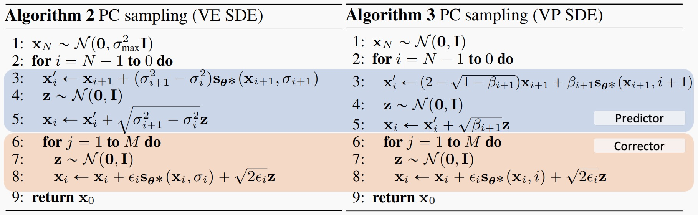

# 基于得分的扩散模型

## Score Matching
  [Estimation of Non-Normalized Statistical Models by Score Matching](https://jmlr.org/papers/volume6/hyvarinen05a/hyvarinen05a.pdf)提出了一种用于估计非归一化统计模型的新方法——分数匹配。该方法巧妙地避免了计算模型中难以处理的归一化常数，为后续的扩散模型等研究奠定了重要基础。

### 得分定义
一个概率分布的得分函数是其对数概率密度关于数据的梯度 
$$
\boldsymbol{S}(\boldsymbol{x} ;\boldsymbol{\theta})=\left(\begin{array}{c}
\frac{\partial\log p(\boldsymbol{x} ;\boldsymbol{\theta})}{\partial x_{1}}\\
\vdots\\
\frac{\partial\log p(\boldsymbol{x} ;\boldsymbol{\theta})}{\partial x_{n}}
\end{array}\right)=\left(\begin{array}{c}
S_{1}(\boldsymbol{x} ;\boldsymbol{\theta})\\
\vdots\\
S_{n}(\boldsymbol{x} ;\boldsymbol{\theta})
\end{array}\right)=\nabla_{\boldsymbol{x}}\log p(\boldsymbol{x} ;\boldsymbol{\theta})
$$

### 训练目标
目标函数：最小化模型分数函数与真实数据分数函数之间的期望平方差  
$$
\begin{align*}
J(\boldsymbol{\theta}) &=\frac{1}{2} \int_{\boldsymbol{x} \in \mathbb{R}^{n}} p_{\mathbf{d}}(\boldsymbol{x})\left\|\boldsymbol{S_m}(\boldsymbol{x} ; \boldsymbol{\theta})-\boldsymbol{S}_{\mathbf{d}}(\boldsymbol{x})\right\|^{2} d \boldsymbol{x} \\
& = \frac{1}{2}\int_{\mathbb{R}^{n}} p_{\mathrm{d}}(\boldsymbol{x}) \left[ \|\boldsymbol{S}_{m}(\boldsymbol{x};\boldsymbol{\theta})\|^2 - 2\boldsymbol{S}_{m}(\boldsymbol{x};\boldsymbol{\theta})^{\top}\boldsymbol{S}_{\mathrm{d}}(\boldsymbol{x}) + \|\boldsymbol{S}_{\mathrm{d}}(\boldsymbol{x})\|^2 \right] d\boldsymbol{x} \\
& = \frac{1}{2}\int_{\mathbb{R}^{n}} p_{\mathrm{d}}(\boldsymbol{x}) \left[ \|\boldsymbol{S}_{m}(\boldsymbol{x};\boldsymbol{\theta})\|^2 - 2\boldsymbol{S}_{m}(\boldsymbol{x};\boldsymbol{\theta})^{\top}\boldsymbol{S}_{\mathrm{d}}(\boldsymbol{x}) \right] d\boldsymbol{x} + C
\end{align*} 
$$

第二项通过分部积分化简 

$$
\begin{align*}
\int_{\mathbb{R}^{n}} p_{\mathrm{d}}(\boldsymbol{x}) \left( -2 \boldsymbol{S}_{m}(\boldsymbol{x};\boldsymbol{\theta})^{\top} \boldsymbol{S}_{\mathrm{d}}(\boldsymbol{x}) \right) d\boldsymbol{x} & = \int_{\mathbb{R}^{n}} p_{\mathrm{d}}(\boldsymbol{x}) \left( -2 \boldsymbol{S}_{m}(\boldsymbol{x};\boldsymbol{\theta})^{\top} \frac{\nabla_{\boldsymbol{x}} p_{\mathrm{d}}(\boldsymbol{x})}{p_{\mathrm{d}}(\boldsymbol{x})} \right) d\boldsymbol{x} \\
& = -2 \int_{\mathbb{R}^{n}} \boldsymbol{S}_{m}(\boldsymbol{x};\boldsymbol{\theta})^{\top} \nabla_{\boldsymbol{x}} p_{\mathrm{d}}(\boldsymbol{x})  d\boldsymbol{x} \\
& = 2 \int_{\mathbb{R}^{n}} div (\boldsymbol{S}_{m}(\boldsymbol{x};\boldsymbol{\theta}))  p_{\mathrm{d}}(\boldsymbol{x})  d\boldsymbol{x}
\end{align*} 
$$

代入原等式可得:  

$$
\begin{align*}
J(\boldsymbol{\theta}) & = \frac{1}{2}\int_{\mathbb{R}^{n}} p_{\mathrm{d}}(\boldsymbol{x}) \left[ \|\boldsymbol{S}_{m}(\boldsymbol{x};\boldsymbol{\theta})\|^2 - 2\boldsymbol{S}_{m}(\boldsymbol{x};\boldsymbol{\theta})^{\top}\boldsymbol{S}_{\mathrm{d}}(\boldsymbol{x}) \right] d\boldsymbol{x} + C \\
&= \frac{1}{2}\int_{\mathbb{R}^{n}} p_{\mathrm{d}}(\boldsymbol{x}) \left[ \|\boldsymbol{S}_{m}(\boldsymbol{x};\boldsymbol{\theta})\|^2 + 2div(\boldsymbol{S}_{m,i}(\boldsymbol{x};\boldsymbol{\theta}))  \right] d\boldsymbol{x} + C \\
&= \int_{\mathbb{R}^{n}} p_{\mathrm{d}}(\boldsymbol{x}) \left[ \frac{1}{2}\|\boldsymbol{S}_{m}(\boldsymbol{x};\boldsymbol{\theta})\|^2 + div(\boldsymbol{S}_{m,i}(\boldsymbol{x};\boldsymbol{\theta}))  \right] d\boldsymbol{x} + C \\
\end{align*}
$$

### 采样方式
给定得分函数$\boldsymbol{S}(\boldsymbol{x};\boldsymbol{\theta})=\nabla_{\boldsymbol{x}}\log p(\boldsymbol{x};\boldsymbol{\theta})$后可以通过朗之万动力学采样。  
为什么朗之万动力学可以采样得分函数？  
由连续性方程与福克普朗克方程等价关系可知，对于速度场为0的ODE其等价的SDE方程为： 
$$
dX_t = \frac{\sigma^2_t}{2} \nabla_x \log p(X_t) dt + \sigma_t dW
$$

根据欧拉-丸山法，其离散形式为： 
$$
\mathbf{x}_{t+1}=\mathbf{x}_t+ \frac {\sigma^2_t} 2 \nabla_{\mathbf{x}} \log p\left(\mathbf{x}_t\right)\Delta t+\sigma_t \sqrt{\Delta t} \mathbf{z}, \quad \mathbf{z} \sim \mathcal{N}(0, \mathbf{I})  
$$

令$\tau = \frac{\sigma^2_t \Delta t}{2}$及扩散系数$\sigma_t$不随时间变化得到朗之万动力学公式:  
$$\mathbf{x}_{t+1}=\mathbf{x}_t+\tau \nabla_{\mathbf{x}} \log p\left(\mathbf{x}_t\right)+\sqrt{2 \tau} \mathbf{z}, \quad \mathbf{z} \sim \mathcal{N}(0, \mathbf{I})$$

因概率密度不随时间变化(动态平衡)，粒子在不同概率区域停留的时间，正比于该区域的概率密度。最终，我们记录下粒子运动的轨迹，这个轨迹就是目标分布`p(x)`的样本。

## Score-SDE
[Score-based generative modeling through stochastic differential equations](https://arxiv.org/pdf/2011.13456)将基于分数的生成建模（score-based generative modeling）与随机微分方程（SDE）统一起来，提出了一个连续的、更一般的生成建模框架。传统的基于分数的生成模型（如NCSN、DDPM）本质上是离散时间、多噪声尺度的扩散过程。本文提出用连续时间的随机微分方程（SDE） 来建模这一过程，并将去噪分数匹配（denoising score matching） 与朗之万动力学采样（Langevin dynamics sampling） 统一到SDE的框架下。

### 背景知识
 对于Noise Conditional Score Network (NCSN)其训练目标是如下的去噪得分匹配的加权和:
\[
\boldsymbol{\theta}^* = \operatorname{arg min}_{\boldsymbol{\theta}} \sum_{i=1}^N \sigma_i^2 \mathbb{E}_{p_{\text{data}}(\mathbf{x})} \mathbb{E}_{p_{\sigma_i}(\tilde{\mathbf{x}}|\mathbf{x})} \left[ \left\| \mathbf{s}_{\boldsymbol{\theta}}(\tilde{\mathbf{x}}, \sigma_i) - \nabla_{\tilde{\mathbf{x}}} \log p_{\sigma_i}(\tilde{\mathbf{x}} | \mathbf{x}) \right\|_{2}^{2} \right].  \tag 1
\]
 对于每一个噪声层级$i$使用Langevin MCMC采样:
\[
\mathbf{x}_i^m = \mathbf{x}_i^{m-1} + \epsilon_i S_\theta^*(\mathbf{x}_i^{m-1}, \sigma_i) + \sqrt{2\epsilon_i}\mathbf{z}_i^m, \quad m=1,2,\dots,M,
\]
 对于DENOISING DIFFUSION PROBABILISTIC MODELS (DDPM)其优化目标如下加权的证据下届evidence lower bound (ELBO)。
\[
\theta^* = \arg \min_{\theta} \sum_{i=1}^{N} (1 - \alpha_i) \mathbb{E}_{p_{\text{data}}(\mathbf{x})} \mathbb{E}_{p_{\alpha_i}(\tilde{\mathbf{x}}|\mathbf{x})} \left[ \left\| \mathbf{s}_{\theta}(\tilde{\mathbf{x}}, i) - \nabla_{\tilde{\mathbf{x}}} \log p_{\alpha_i}(\tilde{\mathbf{x}} | \mathbf{x}) \right\|^2_2 \right] \tag 3
\]
其中:
$$
\begin{gather*}
p(x_i | x_{i-1}) = \mathcal{N}\!\left(x_i; \sqrt{1 - \beta_i} \, x_{i-1}, \beta_i \mathbf{I}\right) \\
p_{\alpha_i}(x_i | x_0) = \mathcal{N}\!\left(x_i; \sqrt{\alpha_i} \, x_0, (1 - \alpha_i) \mathbf{I}\right)
\end{gather*}
$$
注意这里的$\alpha_i$相当于原DDPM论文中的$\bar {\alpha_i}$。
 其反向祖先采样过程如下: 
\[
\mathbf{X}_{i-1} = \frac{1}{\sqrt{1 - \beta_i}}\left(\mathbf{X}_i + \beta_i \mathbf{S}_{\theta*}(\mathbf{X}_i, i)\right) + \sqrt{\beta_i}\mathbf{Z}_i, \quad i = N, N-1, \dots, 1.
\]

### 扩散模型连续化表示-SDE
 扩散过程可由Itˆo SDE建模:
\[
d\mathbf{x} = \mathbf{f}(\mathbf{x},t)dt + g(t)d\mathbf{w},  \tag 5
\]
其中f是漂移项,g是扩散项。 
 根据[Reverse-time diffusion equation models](https://www.sciencedirect.com/science/article/pii/0304414982900515)扩散过程的逆过程也是SDE,且公式如下:
\[
\mathbf{dx} = \left[\mathbf{f}(\mathbf{x},t) - g(t)^2 \nabla_{\mathbf{x}} \log p_t(\mathbf{x})\right]dt + g(t)d\bar{\mathbf{w}},  \tag 6
\]

 为评估得分$\nabla_{\mathbf{x}} \log p_t(\mathbf{x})$,可以训练一个连续泛化版的目标函数:
\[
\theta^* = \underset{\theta}{\arg \min} \mathbb{E}_t \left\{ \lambda(t) \mathbb{E}_{\mathbf{x}(0)} \mathbb{E}_{\mathbf{x}(t)|\mathbf{x}(0)} \left[ \left\| \mathbf{s}_\theta(\mathbf{x}(t), t) - \nabla_{\mathbf{x}(t)} \log p_{0t}(\mathbf{x}(t) | \mathbf{x}(0)) \right\|_2^2 \right] \right\}.  \tag 7
\]
 其中$λ$是权重函数。

### 漂移项f和扩散项g
#### NCSN/SMLD
 得分匹配扩散模型离散前向过程为:
\[
\mathbf{x}_i = \mathbf{x}_{i-1} + \sqrt{\sigma_i^2 - \sigma_{i-1}^2} \mathbf{z}_{i-1}, \quad i = 1, \dots, N  \tag {20}
\]
 令$t=i/N,\Delta t=1/N$, 公式20可以如下表示:
$$
\begin{align*}
\mathbf{x}(t+\Delta t) &= \mathbf{x}(t) + \sqrt{\sigma^2(t+\Delta t) - \sigma^2(t)} \mathbf{z}(t) \\ 
&\approx \mathbf{x}(t) + \sqrt{\frac{\mathrm{d}[\sigma^2(t)]}{\mathrm{d}t}\Delta t} \mathbf{z}(t)
\end{align*}
$$
 当$N \rightarrow \infin, \Delta t \rightarrow 0$时可得时间连续DCSN的SDE方程如下:
\[
\mathrm{d}\mathbf{x} = \sqrt{\frac{\mathrm{d}[\sigma^2(t)]}{\mathrm{d}t}}\mathrm{d}\mathbf{w}. \tag {21}
\]  
注：$d\mathbf{w}=\sqrt{\Delta t}\mathbf{z}$
#### DDPM
 对于去噪扩散模型，其前向过程每一步加噪由如下公式定义:
\[
\mathbf{x}_i = \sqrt{1 - \beta_i}\mathbf{x}_{i-1} + \sqrt{\beta_i}\mathbf{z}_{i-1}, \quad i = 1, \dots, N, 
\tag {22}
\]  
 其中$\beta_i为每一步噪声,当步数N走够大时,每个\beta_i都是很小的$,令$\beta(t)=N\beta_i,t=i/N,\Delta t=1/N$,

$$
\begin{align*}
\mathbf{x}(t + \Delta t) &= \sqrt{1 - \beta(t + \Delta t)\Delta t} \mathbf{x}(t) + \sqrt{\beta(t + \Delta t)\Delta t} \mathbf{z}(t) \\
&\approx \mathbf{x}(t) - \frac{1}{2}\beta(t + \Delta t)\Delta t \mathbf{x}(t) + \sqrt{\beta(t + \Delta t)\Delta t} \mathbf{z}(t) \quad // \sqrt{1 - \varepsilon} \approx 1 - \frac{1}{2} \varepsilon; \quad \varepsilon \text{当很小时,这里}\varepsilon=\beta(t + \Delta t)\Delta t \\
&\approx \mathbf{x}(t) - \frac{1}{2}\beta(t)\Delta t \mathbf{x}(t) + \sqrt{\beta(t)\Delta t} \mathbf{z}(t),
\end{align*}
$$
 当$N \rightarrow \infin, \Delta t \rightarrow 0$时,可得时间连续DDPM的SDE方程如下:
\[
\mathrm{d}\mathbf{x} = -\frac{1}{2}\beta(t)\mathbf{x}\,\mathrm{d}t + \sqrt{\beta(t)}\,\mathrm{d}\mathbf{w}. \tag {24}
\]
需要注意的是:在NCSN中$\sigma_i=\sigma(t)$,但是在DDPM中$\beta_i \not=\beta(t)$,而是$\beta(t)=N\beta_i$,但是仍然都使用符号$\beta$,很容易误以为是想等的。

\[
\Sigma_{\text{VP}}(t) = \mathbf{I} + e^{\int_0^t -\beta(s) \, ds} \left(\Sigma_{\text{VP}}(0) - \mathbf{I}\right)
\]

\[
\mathrm{d}\mathbf{x} = -\frac{1}{2}\beta(t)\mathbf{x} \, \mathrm{d}t + \sqrt{\beta(t)\left(1 - e^{-2\int_{0}^{t}\beta(s) \, \mathrm{d}s}\right)} \, \mathrm{d}\mathbf{w}.
\]

\[
\Sigma_{\text{sub-VP}}(t) = \mathbf{I} + e^{-2 \int_0^t \beta(s) ds} \mathbf{I} + e^{-\int_0^t \beta(s) ds} \left(\Sigma_{\text{sub-VP}}(0) - 2\mathbf{I}\right),
\]

\[
p_{0t}(\mathbf{x}(t) \mid \mathbf{x}(0)) = \left\{
\begin{array}{ll}
\mathcal{N}(\mathbf{x}(t); \mathbf{x}(0), [\sigma^2(t) - \sigma^2(0)]\mathbf{I}), \\
\mathcal{N}(\mathbf{x}(t); \mathbf{x}(0)e^{-\frac{1}{2}\int_0^t \beta(s)ds}, \mathbf{I} - \mathbf{I}e^{-\int_0^t \beta(s)ds}) \\
\mathcal{N}(\mathbf{x}(t); \mathbf{x}(0)e^{-\frac{1}{2}\int_0^t \beta(s)ds}, [1 - e^{-\int_0^t \beta(s)ds}]^2\mathbf{I})
\end{array}
\right.
\]

### 逆扩散采样
 根据Reverse-time SDE公式:
\[
\mathbf{dx} = \left[\mathbf{f}(\mathbf{x},t) - g(t)^2 \nabla_{\mathbf{x}} \log p_t(\mathbf{x})\right]dt + g(t)d\bar{\mathbf{w}},  \tag 6
\]
 可知拟扩散过程采样一般公式如下:
\[
\mathbf{x}(t-\Delta t) =\mathbf{x}(t) - \left[\mathbf{f}(\mathbf{x},t) - g(t)^2 \nabla_{\mathbf{x}} \log p_t(\mathbf{x})\right]\Delta t + g(t)d\bar{\mathbf{w}},  \tag {46}
\]
#### DCSN
 对于去噪扩散模型$\mathbf{f}(\mathbf{x},t)=0,g(t)=\sqrt{\frac{\mathrm{d}[\sigma^2(t)]}{\mathrm{d}t}}$,因此有:
$$
\begin{align*}
\mathbf{x}(t-\Delta t) &=\mathbf{x}(t) - \left[0 - \frac{\mathrm{d}[\sigma^2(t)]}{\mathrm{d}t} \mathbf{s}_{\boldsymbol{\theta}^*}(\mathbf{x}_{t}, t)\right]\Delta t + \sqrt{\frac{\mathrm{d}[\sigma^2(t)]}{\mathrm{d}t}}d\bar{\mathbf{w}} \\
&=\mathbf{x}(t) + \frac{\sigma^2(t-\Delta t)-\sigma^2(t)}{-\Delta t} \mathbf{s}_{\boldsymbol{\theta}^*}(\mathbf{x}_{t}, t)\Delta t + \sqrt{\frac{\sigma^2(t-\Delta t)-\sigma^2(t)}{-\Delta t} }\sqrt{\Delta t}\mathbf{z} \\
&=\mathbf{x}(t) + \left(\sigma^2(t)-\sigma^2(t-\Delta t)\right) \mathbf{s}_{\boldsymbol{\theta}^*}(\mathbf{x}_{t}, t) + \sqrt{\sigma^2(t)-\sigma^2(t-\Delta t)}\mathbf{z}
\end{align*}
$$
 使用原始的离散符号表示有:
\[
\mathbf{x}_{i-1} = \mathbf{x}_i + (\sigma_i^2 - \sigma_{i-1}^2)\mathbf{s}_{\theta^\ast}(\mathbf{x}_i, i) + \sqrt{(\sigma_i^2 - \sigma_{i-1}^2)}\mathbf{z}_i, i = 1, 2, \dots, N
\]
 论文中给出的离散采样公式如下:
\[
\mathbf{x}_{i-1} = \mathbf{x}_i + (\sigma_i^2 - \sigma_{i-1}^2)\mathbf{s}_{\theta^\ast}(\mathbf{x}_i, i) + \sqrt{\frac{\sigma_{i-1}^2(\sigma_i^2 - \sigma_{i-1}^2)}{\sigma_i^2}}\mathbf{z}_i, i = 1, 2, \dots, N \tag {47}
\]
 这与Reverse-time SDE推导有结果细微差异,原文中说明参考DDPM给的方差值，而DDPM通过每一个反向步也近似为高斯过程推导得到的，且说这两种方差结果相似。也不清楚为何要参考DDPM的，而不是用SDE推导的结果，DDPM与DCSN噪声调度有较大差异。

#### DDPM
 对于去噪扩散模型$\mathbf{f}(\mathbf{x},t)=-\frac 1 2 \beta(t)\mathbf{x},g(t)=\sqrt{\beta(t)}$,因此有:
$$
\begin{align*}
\mathbf{x}(t-\Delta t) &=\mathbf{x}(t) - \left[-\frac 1 2 \beta(t)\mathbf{x}(t) - \beta(t) \mathbf{s}_{\boldsymbol{\theta}^*}(\mathbf{x}_{t}, t)\right]\Delta t + \sqrt{\beta(t)}d\bar{\mathbf{w}} \\
&=\mathbf{x}(t) + \left[\frac 1 2 \mathbf{x}(t) + \mathbf{s}_{\boldsymbol{\theta}^*}(\mathbf{x}_{t}, t)\right]\beta(t)\Delta t + \sqrt{\beta(t)\Delta t}\mathbf{z} \\
\Leftrightarrow \mathbf{x}_{i-1} &= \mathbf{x}_i + \left[\frac 1 2 \mathbf{x}_i + \mathbf{s}_{\boldsymbol{\theta}^*}(\mathbf{x}_{i}, i)\right]\beta_i + \sqrt{\beta_i}\mathbf{z_i} \qquad //由\beta(t)=N\beta_i,\Delta t=1/N=>\beta(t)\Delta t=\beta_i \\
&=(1+\frac 1 2 \beta_i)\mathbf{x}_i + \beta_i \mathbf{s}_{\boldsymbol{\theta}^*}(\mathbf{x}_{i}, i)+ \sqrt{\beta_i}\mathbf{z_i} \tag {DDPM-Sampler}
\end{align*}
$$  
 本文直接从DDPM离散采样过程公式推导转换,做了如下推导(不清楚意义在哪里,原本就是逆过程采样,推导后表达形式不一样了)  

$$
\begin{align*}
\mathbf{x}_i &= \frac{1}{\sqrt{1 - \beta_{i+1}}} \left(\mathbf{x}_{i+1} + \beta_{i+1}\mathbf{s}_{\boldsymbol{\theta}^*}(\mathbf{x}_{i+1}, i + 1)\right) + \sqrt{\beta_{i+1}}\mathbf{z}_{i+1} \\
&= \left(1 + \frac{1}{2}\beta_{i+1} + o(\beta_{i+1})\right) \left(\mathbf{x}_{i+1} + \beta_{i+1}\mathbf{s}_{\boldsymbol{\theta}^*}(\mathbf{x}_{i+1}, i + 1)\right) + \sqrt{\beta_{i+1}}\mathbf{z}_{i+1} \\
&\approx \left(1 + \frac{1}{2}\beta_{i+1}\right) \left(\mathbf{x}_{i+1} + \beta_{i+1}\mathbf{s}_{\boldsymbol{\theta}^*}(\mathbf{x}_{i+1}, i + 1)\right) + \sqrt{\beta_{i+1}}\mathbf{z}_{i+1} \\
&= \left(1 + \frac{1}{2}\beta_{i+1}\right) \mathbf{x}_{i+1} + \beta_{i+1}\mathbf{s}_{\boldsymbol{\theta}^*}(\mathbf{x}_{i+1}, i + 1) + \frac{1}{2}\beta_{i+1}^2 \mathbf{s}_{\boldsymbol{\theta}^*}(\mathbf{x}_{i+1}, i + 1) + \sqrt{\beta_{i+1}}\mathbf{z}_{i+1} \\
&\approx \left(1 + \frac{1}{2}\beta_{i+1}\right) \mathbf{x}_{i+1} + \beta_{i+1}\mathbf{s}_{\boldsymbol{\theta}^*}(\mathbf{x}_{i+1}, i + 1) + \sqrt{\beta_{i+1}}\mathbf{z}_{i+1} \qquad //\text{这就是DDPM-Sampler公式}\\
&= \left[2 - \left(1 - \frac{1}{2}\beta_{i+1}\right)\right] \mathbf{x}_{i+1} + \beta_{i+1}\mathbf{s}_{\boldsymbol{\theta}^*}(\mathbf{x}_{i+1}, i + 1) + \sqrt{\beta_{i+1}}\mathbf{z}_{i+1} \\
&\approx \left[2 - \left(1 - \frac{1}{2}\beta_{i+1}\right) + o(\beta_{i+1})\right] \mathbf{x}_{i+1} + \beta_{i+1}\mathbf{s}_{\boldsymbol{\theta}^*}(\mathbf{x}_{i+1}, i + 1) + \sqrt{\beta_{i+1}}\mathbf{z}_{i+1} \\
&= \left(2 - \sqrt{1 - \beta_{i+1}}\right) \mathbf{x}_{i+1} + \beta_{i+1}\mathbf{s}_{\boldsymbol{\theta}^*}(\mathbf{x}_{i+1}, i + 1) + \sqrt{\beta_{i+1}}\mathbf{z}_{i+1}.
\end{align*}
$$

### PREDICTOR-CORRECTOR SAMPLERS
 原始的DDPM采样过程其实就是一个去噪过程(预测器)，而原始NCSN的采样过程仅在每个噪声层级采样t时刻分布的样本(校正器),本文提出一个**预测-校正采样器**每个采样执行一次去噪预测和当前噪声等级的朗之万动力学采样,预测-校正采样器比单纯的去噪预测或单纯校正采样效果要好。

