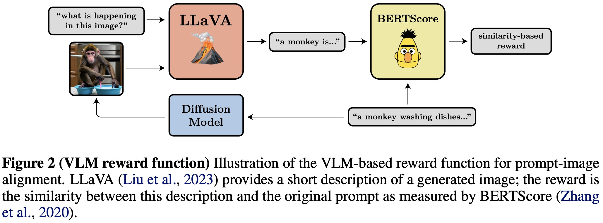
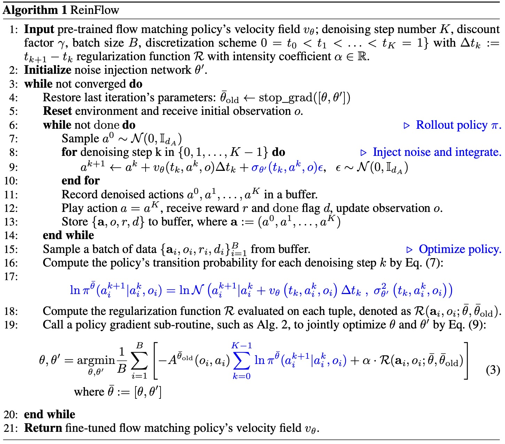
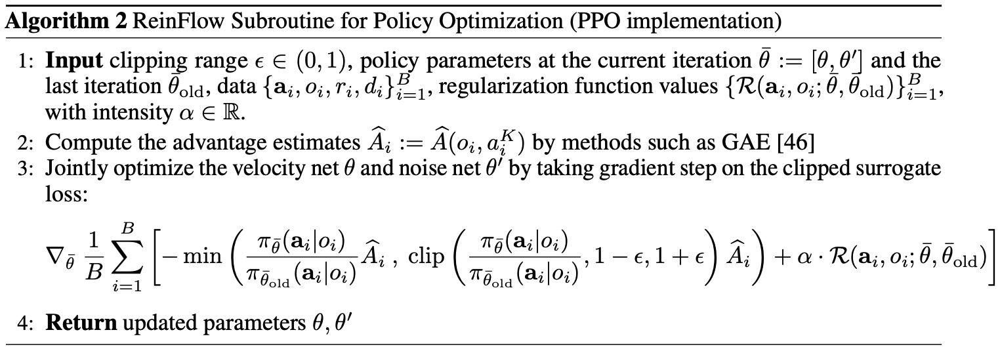
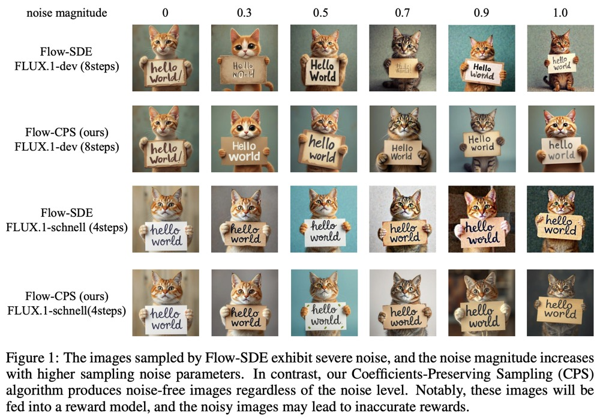
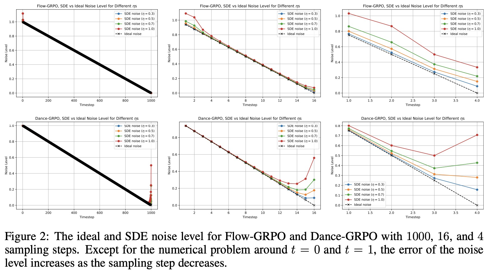
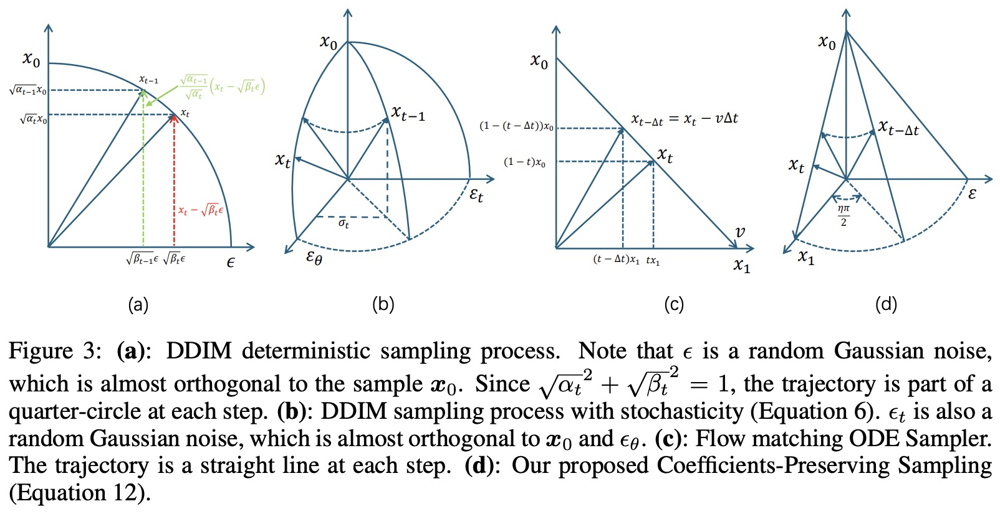

# 基于扩散模型的强化学习

## QSM
 [Learning a Diffusion Model Policy from Rewards via Q-Score Matching](https://arxiv.org/pdf/2312.11752)

## DDPO
 [TRAINING DIFFUSION MODELS WITH REINFORCEMENT LEARNING](https://arxiv.org/pdf/2305.13301)直接优化扩散模型（diffusion models）以满足特定的下游目标（downstream objectives），而不是仅仅匹配数据分布。  
 大多数扩散模型的使用场景并不直接关注似然度（likelihoods），而是关注于人类感知的图像质量、药物有效性等下游目标。本文提出了一种基于强化学习（reinforcement learning, RL）的方法，称为去噪扩散策略优化（denoising diffusion policy optimization, DDPO），来直接针对这些下游目标训练扩散模型。 
### 核心思想
 去噪过程（denoising process）作为一个多步马尔可夫决策问题（multi-step markov decision-making problem），以便使用策略梯度算法（policy gradient algorithms）来优化扩散模型。

**多步MDP定义**
$$
\begin{equation*}
\begin{gathered}
\mathbf{s}_t \triangleq (\mathbf{c}, t, \mathbf{x}_t) \ \ \ // 状态 \\
\mathbf{a}_t \triangleq \mathbf{x}_{t-1}\ \ \ //动作为单步去噪结果\\
\pi(\mathbf{a}_t | \mathbf{s}_t) \triangleq p_\theta(\mathbf{x}_{t-1} | \mathbf{x}_t, \mathbf{c})  \ \ \ //策略 \\
P(\mathbf{s}_{t+1} | \mathbf{s}_t, \mathbf{a}_t) \triangleq (\delta_{\mathbf{c}}, \delta_{t-1}, \delta_{\mathbf{x}_{t-1}}) \ \ \ //确定性状态转移\\
p_0(\mathbf{s}_0) \triangleq (p(\mathbf{c}), \delta_T, \mathcal{N}(\mathbf{0}, \mathbf{I})) \ \ \ //初始状态分布 \\
R(\mathbf{s}_t, \mathbf{a}_t) \triangleq 
\begin{cases} 
r(\mathbf{x}_0, \mathbf{c}) & \text{if } t = 0 \ \ \ //只有最后一步有奖励\\ 
0 & \text{otherwise}
\end{cases}
\end{gathered}
\end{equation*}
$$

**策略梯度估计**
  可直接使用Monte Carlo估计  
  DDPO（去噪扩散策略优化）的第一个变体，我们称之为 DDPOsf，使用得分函数策略梯度估计器(REINFORCE)
$$
\begin{equation*}
\nabla_{\theta} \mathcal{J}_{\text{DDRL}} = \mathbb{E} \left[ \sum_{t=0}^{T} \nabla_{\theta} \log p_{\theta}(x_{t-1} \, | \, x_t, \mathbf{c}) \, r(\mathbf{x}_0, \mathbf{c}) \right]
\tag{DDPOsf}
\end{equation*}
$$
 DDPOsf每轮数据收集只允许进行一次优化步骤，因为梯度必须使用当前参数生成的数据计算。为了执行多步优化，我们可以使用重要性采样估计器DDPOis
$$
\begin{equation*}
\nabla_{\theta} \mathcal{J}_{\text{DDRL}} = \mathbb{E} \left[ \sum_{t=0}^{T} \frac{p_{\theta}(x_{t-1} \, | \, x_t, \mathbf{c})}{p_{\theta_{\text{old}}}(x_{t-1} \, | \, x_t, \mathbf{c})} \nabla_{\theta} \log p_{\theta}(x_{t-1} \, | \, x_t, \mathbf{c}) \, r(\mathbf{x}_0, \mathbf{c}) \right]
\tag{DDPOis}
\end{equation*}
$$

### DDPO应用示例
  奖励函数根据下游任务确定,下图是一个提示-图像对齐的示例，给一个提示文本，扩散模型生成图像，利用VLM模型给生成的图像生成描述，最后再利用LLM模型判断原始提示文本与生成描述的相似度作为奖励。

## ReinFlow
&ensp;&ensp;&ensp;&ensp;[ReinFlow: Fine-tuning Flow Matching Policy with Online Reinforcement Learning](https://arxiv.org/pdf/2505.22094)通过注入有界且可学习的噪声来促进在线微调期间的探索。ReinFlow是第一个在线强化学习算法，能够稳定地微调一系列流匹配策略，尤其是在非常少甚至一个去噪步骤下。它具有轻量级的实现、内置的探索机制，并且可以广泛应用于各种流策略变体，包括Rectified Flow和 Shortcut Models。  

&ensp;&ensp;&ensp;&ensp;RL和流匹配结合面临两个问题，一是流匹配是确定性的,而RL需要探索试错来学习;而是RL策略优化需要利用策略下各动作概率分布,流匹配中计算策略下动作概率分布困难

### 流匹配中的动作概率
  流匹配中的向量场$v(t, x)$，它定义了状态的微分方程：
$$
  \frac{d}{dt} \psi_t(x) = v(t, \psi_t(x))
$$
- 其中$\psi_t(x)$是从初始状态x在时间t的流flow，初始条件为$\psi_0(x) = x$。  
- 初始分布为$p_0(\cdot)$，时间t的分布为$p_t(\cdot)$，通过流$\psi_t$ 变换得到。

#### 推导过程
1. **概率密度的连续性方程**：
  在确定性流中，概率密度$p_t(\psi_t(x))$ 满足连续性方程（无扩散项）：  
$$
\begin{equation*}
   \frac{\partial p_t(\psi_t(x))}{\partial t} = - \nabla \cdot (p_t(\psi_t(x)) v(t, \psi_t(x)))
\end{equation*}
$$
  这里，$\nabla \cdot$ 表示散度算子。

2. **沿轨迹的概率密度变化**：
   概率密度$p_t(\psi_t(x))$。这是一个复合函数，其对时间 t 的全导数为：
$$
\begin{equation*}
   \begin{aligned}
    \frac{d}{dt} p_t(\psi_t(x)) &= \frac{\partial p_t}{\partial {d \psi_t(x)}} \cdot \frac{d \psi_t(x)}{dt} \\
    &= \nabla p_t \cdot v \\ 
    &=- p_t \nabla \cdot v \ \ \ \ //分部积分 
    \end{aligned}
\end{equation*}
$$  

3. **对数概率密度的变化**：
   现在计算对数概率密度的导数：  
$$
\begin{equation*}
\begin{aligned}
   \frac{d}{dt} \ln p_t(\psi_t(x)) &= \frac{1}{p_t(\psi_t(x))}  \frac{d}{dt} p_t(\psi_t(x)) \\ 
   &= \frac{1}{-p_t} - p_t \nabla \cdot v(t, \psi_t(x)) \ \ \ //连续性方程定义\\
   &= - \nabla \cdot v(t, \psi_t(x))
\end{aligned}
\end{equation*}
$$  

4. **积分从时间 0 到 1**：
   对上述方程从 `t=0` 到 `t=1` 积分：  
$$
\begin{equation*}
\begin{aligned}
   \int_0^1 \frac{d}{dt} \ln p_t(\psi_t(x)) \, dt = \int_0^1 - \nabla \cdot v(t, \psi_t(x)) \, dt \\
   \ln p_1(\psi_1(x)) - \ln p_0(\psi_0(x)) = - \int_0^1 \nabla \cdot v(t, \psi_t(x)) \, dt
\end{aligned}
\end{equation*}   
$$
   因此，最终得到：  
$$
\begin{equation}
   \ln p_1(\psi_1(x)) = \ln p_0(\psi_0(x)) - \int_0^1 \nabla \cdot v(t, \psi_t(x)) \,dt  \tag 4
\end{equation}
$$
   这就是论文中的公式4。

#### 说明
- 这个公式允许我们计算最终概率密度 $p_1$ 的对数，通过初始概率密度和向量场散度的积分。
- 使用迹估计器（trace estimator）会引入**蒙特卡洛误差**，而通过模拟计算积分会引入**离散化误差**。当使用大步长（即较少的去噪步骤）以追求快速推理时，这种离散化误差会尤其显著。
- 在推理中将流过程视为**离散时间马尔可夫过程**可以缓解这个问题.然而，中间变量遵循确定性转移,那么就无法计算其概率，这使得基于概率的马尔可夫过程方法在此失效。

### 中间动作的确定性
  由于流匹配是ODE建模的，因此每一步都是确定性定，满足如下方程:  
$$
\begin{equation*}
p(X_{t+\Delta t} = x|X_t) = \delta(x - X_t - v_\theta(t,X_t)\Delta t)
\end{equation*}
$$  

### ReinFlow算法

**注入可学习噪声**:ReinFlow通过注入可学习的噪声，将流策略的确定性路径转换为离散时间马尔可夫过程。这一转换使得流模型在任意少的去噪步骤下都能进行精确且简单的似然计算，从而促进探索并确保训练的稳定性。  
ReinFlow训练了一个噪声注入网络，该网络根据当前动作、时间和观测值输出噪声的标准差。这种设计允许噪声网络自动平衡探索与利用，且具有轻量级实现和广泛的适用性。  
**精确似然表达式**: ReinFlow通过将流模型转换为离散时间马尔可夫过程，得到了一个精确且简单的似然表达式。这使得在非常少的去噪步骤下也能进行有效的策略梯度优化。  
**策略梯度定理**: 建立了离散时间马尔可夫过程策略的策略梯度定理，这为ReinFlow的算法设计提供了理论支持，并使得可以应用各种现代深度策略梯度算法来优化噪声注入的流策略。  

  加入噪声网络后每一步的采样概率满足如下公式:  
$$
\begin{equation}
a^0 \sim \mathcal{N}(0, \mathbb{I}_{d_A}), \quad a^{k+1} \sim \mathcal{N}\left( \cdot | a^k + v_\theta(t_i, a^k, o) \Delta t_i, \sigma_{\theta'}^2(t_i, a^k, o) \right)  \tag{6}
\end{equation}
$$  
  整个去噪过程的联合对数概率(马尔可夫性):  
$$
\begin{equation}
\ln \pi(a^0, \ldots, a^K|_0; \theta, \theta') = \ln \mathcal{N}(0, \mathbb{I}_{d_A}) + \sum_{k=0}^{K-1} \ln \mathcal{N}\left( a^{k+1}|a_h^k + v_\theta(t_k, a_h^k, o) \Delta t_k, \sigma_{\theta'}^2(t_k, a^k, o) \right) \tag{7}
\end{equation}
$$  
  在均匀离散化下，$t_k = \frac{k}{K}$ 且 $\Delta t_k = \frac{1}{K}$。

- ReinFlow算法
  
 
- 策略梯度-PPO实现 

## Flow-GRPO
 [Flow-GRPO: Training Flow Matching Models via Online RL](https://arxiv.org/pdf/2505.05470)
 ReinFlow算法通过在流批匹配每一步采样过程中增加噪声来实现随机探索,Flow-GRPO直接将流匹配采样过程转为等价的SDE过程。对于Rectified Flow，带澡数据$x_t$ 满足如下公式
$$
\begin{equation*}
x_t = (1 - t) x_0 + t x_1
\end{equation*}
$$
 其中$x_0$为正式数据分布,$x_1$为高斯噪声分布。该流匹配对于前向过程ODE公式如下:
$$
\begin{equation*}
dx_t = v_tdt
\end{equation*}
$$ 
根据福克-普朗克方程（Fokker-Planck Equation, FPE）中SDE与ODE的等价关系，其对应的SDE方程如下：
$$
\begin{equation*}
dx_t = \left( v_t(x_t) + \frac{\sigma_t^2}{2} \nabla \log p_t(x_t) \right) dt + \sigma_t dw 
\end{equation*}
$$ 

根据Reverse-time SDE公式可知其对应的反向采样过程SDE满足如下公式:

$$
\begin{align*}
dx_t &= \left( v_t(x_t) + \frac{\sigma_t^2}{2} \nabla \log p_t(x_t) - \sigma_t^2 \nabla \log p_t(x_t) \right) dt + \sigma_t dw \\
&=\left( v_t(x_t) - \frac{\sigma_t^2}{2} \nabla \log p_t(x_t) \right) dt + \sigma_t dw \tag{7}
\end{align*} 
$$  
而对于通用的高斯概率路径$x_t \sim \mathcal{N}\left(x_t \mid \alpha_t x_0, \beta_t^2 I\right)$得分函数与速度场满足如下公式： 

$$
\begin{align*}
s_{t}(x)&=\frac{\alpha_{t}u_{t}(x)-\dot{\alpha}_{t}x}{\beta_{t}^{2}\dot{\alpha}_{t}-\alpha_{t}\dot{\beta}_{t}\beta_{t}} \\ 
&=\frac{(1-t)u_{t}(x)+x}{t^{2}(-1)-(1-t)t} \quad //\alpha_t = 1 − t, \beta_t = t, \dot{\alpha}_{t}=-1,\dot{\beta}_{t}=1 \\
&=\frac{(1-t)u_{t}(x)+x}{-t} \\
&=-\frac{x}{t} -\frac{(1-t)u_{t}}{t}
\end{align*} 
$$  

将上式带入公式7有  

$$
\begin{equation*}
dx_t = \left[ v_t(x_t) + \frac{\sigma_t^2}{2t} \bigl( x_t + (1-t)v_t(x_t) \bigr) \right] dt + \sigma_t dw \tag 8
\end{equation*}
$$

 为数值求解 SDE，采用 **Euler-Maruyama 离散化方法**，得到如下更新公式：

$$
\begin{equation*}
\boldsymbol{x}_{t-\Delta t} = \boldsymbol{x}_t - \left[ v_\theta(\boldsymbol{x}_t, t) + \frac{\sigma_t^2}{2t}(\boldsymbol{x}_t + (1 - t)v_\theta(\boldsymbol{x}_t, t)) \right] \Delta t + \sigma_t\sqrt{\Delta t}\epsilon \tag 9 
\end{equation*}
$$

注意：原论文中公式是错误的,反向采样过程$t-\Delta t$,而不是$t+\Delta t$

## Flow-CPS
[COEFFICIENTS-PRESERVING SAMPLING FOR REINFORCEMENT LEARNING WITH FLOW MATCHING](https://arxiv.org/pdf/2509.05952)Flow-GRPO、Dance-GRPO 等方法为了获得样本多样性，将确定性 Flow-ODE 改写成随机微分方程（SDE），但生成的图像在训练阶段始终带有显著噪声。本文通过理论分析表明，SDE 每步注入的随机项与调度器要求的噪声水平不匹配，造成“超额噪声”不断累积，最终噪声水平不为零。  
  本文提出 Coefficients-Preserving Sampling（CPS），在保持调度器系数严格一致的前提下注入随机性，彻底消除噪声伪影，使奖励计算准确，进而提升 RL 训练速度与稳定性。

### 理论分析

**定义1（系数保持采样）Coefficients-Preserving Sampling**  
若某个采样过程满足以下两个条件，则被视为**系数保持采样**：
1. **样本系数**必须严格遵循**调度器**在所有时间步上的分配。  
2. **总噪声水平**（定义为单个多元噪声的标准差或多个独立噪声的标准差之和）必须与调度器在所有时间步上保持一致。

**DDIM采样**公式如下: 
$$
\begin{equation*}
x_{t-1} = \underbrace{\sqrt{\alpha_{t-1}} \left( \frac{x_t - \sqrt{1 - \alpha_t} \epsilon_\theta^{(t)}(x_t)}{\sqrt{\alpha_t}} \right)}_{\text{predicted}\ x_0} + \sqrt{1 - \alpha_{t-1} - \sigma_t^2} \cdot \underbrace{\epsilon_\theta^{(t)}(x_t)}_{\text{predicted}\ noise} + \underbrace{\sigma_t \epsilon_t}_{\text{random noise}}
\end{equation*}
$$  

其中：
- $\alpha_t$ 是噪声调度参数，控制前向过程的方差。
- $\epsilon_\theta^{(t)}(x_t)$ 是训练好的去噪网络，用于预测给定 $x_t$ 时的噪声。
- $\epsilon_t \sim \mathcal{N}(0, I)$ 是独立于 $\epsilon_\theta^{(t)}(x_t)$的额外高斯噪声，其系数 $\sigma_t$ 控制随机性水平。
- 当 $\sigma_t = \sqrt{\frac{1 - \alpha_{t-1}}{1 - \alpha_t}} \sqrt{1 - \frac{\alpha_t}{\alpha_{t-1}}}$**
此时前向过程是**马尔可夫的**（Markovian），生成过程等价于 **DDPM**（标准的随机扩散模型）
   
显然DDIM采样是系数保持的。

**FLOW-SDE采样**

在流匹配采样过程中，可以通过以下公式预测样本$\hat{x}_0$ 和噪声$\hat{x}_1$：
$$
\begin{equation*}
\hat{x}_0 = x_t - t\hat{v}, \quad \hat{x}_1 = x_t + (1 - t)\hat{v}.
\end{equation*}
$$
Flow-ODE采样更新公式如下：

$$
\begin{align*}
\hat{x}_{t-\Delta t} &= x_t - \hat{v}_\theta(x_t, t) \Delta t \\
&= (1 - (t - \Delta t)) \underbrace{(x_t - t\hat{v}_\theta(x_t, t))}_{\text{predicted } \hat{x}_0} + (t - \Delta t) \underbrace{(x_t + (1 - t)\hat{v}_\theta(x_t, t))}_{\text{predicted } \hat{x}_1} \\
&= \underbrace{(1 - (t - \Delta t))}_{\text{coefficient of sample}} \hat{x}_0 + \underbrace{(t - \Delta t)}_{\text{coefficient of noise}}\hat{x}_1.  \tag 8
\end{align*}
$$  

所以流匹配中样本系数调度满足样本和噪声系数之和为1

Flow-SDE采样更新公式如下：

$$
\begin{align*}
x_{t-\Delta t} &= x_t - \left[ \hat{v}_\theta(x_t, t) + \frac{\sigma_t^2}{2t} \left( x_t + (1 - t)\hat{v}_\theta(x_t, t) \right) \right] \Delta t + \sigma_t \sqrt{\Delta t} \epsilon \\
&= x_t - \hat{v}_\theta(x_t, t) \Delta t - \frac{\sigma_t^2 \Delta t}{2t} \hat{x}_1 + \sigma_t \sqrt{\Delta t} \epsilon \quad // \hat{x}_1 = x_t + (1-t)\hat{v}_\theta(x_t, t)) \\
&= (1-t)\hat{x}_0 + t\hat{x}_1 - (\hat{x}_1 - \hat{x}_0) \Delta t - \frac{\sigma_t^2 \Delta t}{2t} \hat{x}_1 + \sigma_t \sqrt{\Delta t} \epsilon \quad //公式8\\
&= (1-t + \Delta t) \hat{x}_0 + \left( t - \Delta t - \frac{\sigma_t^2 \Delta t}{2t} \right) \hat{x}_1 + \sigma_t \sqrt{\Delta t} \epsilon 
\end{align*}
$$

该形式与DDIM采样公式结构类似，将下一步状态表示为预测初值$\hat{x}_0$和预测终值$\hat{x}_1$的线性组合，外加一个显式噪声项。

**总噪声**:假设 $\hat{x}_1$ 服从标准高斯分布 $\mathcal{N}(0, I)$，且与 $\epsilon$ 独立，则 $x_{t-\Delta t}$ 中随机部分的方差为：
$$
\sigma_{\text{total}}^2 = \left( t - \Delta t - \frac{\sigma_t^2 \Delta t}{2t} \right)^2 + \sigma_t^2 \Delta t.
$$

展开并化简：

$$
\begin{aligned}
\sigma_{\text{total}}^2 &= (t - \Delta t)^2 - 2(t - \Delta t) \frac{\sigma_t^2 \Delta t}{2t} + \left( \frac{\sigma_t^2 \Delta t}{2t} \right)^2 + \sigma_t^2 \Delta t \\
&= (t - \Delta t)^2 - \frac{\sigma_t^2 \Delta t}{t} (t - \Delta t) + \left( \frac{\sigma_t^2 \Delta t}{2t} \right)^2 + \sigma_t^2 \Delta t \\
&= (t - \Delta t)^2 + \sigma_t^2 \Delta t \left( 1 - \frac{t - \Delta t}{t} \right) + \left( \frac{\sigma_t^2 \Delta t}{2t} \right)^2 \\
&= (t - \Delta t)^2 + \sigma_t^2 \Delta t \cdot \frac{\Delta t}{t} + \left( \frac{\sigma_t^2 \Delta t}{2t} \right)^2 \\
&= (t - \Delta t)^2 + \left( \frac{\sigma_t \Delta t}{\sqrt{t}} \right)^2 + \left( \frac{\sigma_t^2 \Delta t}{2t} \right)^2.
\end{aligned}
$$

因此，总噪声水平（标准差）为：
$$
\sigma_{\text{total}} = \sqrt{ (t - \Delta t)^2 + \left( \frac{\sigma_t \Delta t}{\sqrt{t}} \right)^2 + \left( \frac{\sigma_t^2 \Delta t}{2t} \right)^2 }.
$$

由于后两项非负，显然有：
$$
\sigma_{\text{total}} \geq \sqrt{(t - \Delta t)^2} = t - \Delta t.
$$

因此Flow-SDE的总噪声水平超过了前向过程中调度的噪声水平。

### 解决方案

**Flow-SDE的主要问题在于**，减少的噪声水平 $\frac{\sigma_t^2 \Delta t}{2t}$ 无法与新增的噪声水平 $\sigma_t \sqrt{\Delta t}$ 相匹配。注意到DDIM在采样过程中注入噪声的同时也保持了噪声水平（图3.b），我们考虑参考DDIM采样来解决此问题。假设新增噪声的方差为 $\sigma_t^2$，为满足CPS第二项条件的要求，预测噪声的系数应为 $\sqrt{(t - \Delta t)^2 - \sigma_t^2}$。这样，采样公式为：

$$\boldsymbol{x}_{t-\Delta t} = (1 - (t - \Delta t)) \hat{\boldsymbol{x}}_0 + \sqrt{(t - \Delta t)^2 - \sigma_t^2} \hat{\boldsymbol{x}}_1 + \sigma_t \epsilon,$$

其形式与带随机性的DDIM非常相似。

对于噪声水平 $\sigma_t$，其最大值为 $t - \Delta t$，否则根号内会出现负的被开方数。为避免负的被开方数，我们提出设定 $\sigma_t = (t - \Delta t) \sin(\frac{\eta \pi}{2})$。此时采样公式变为：

$$\boldsymbol{x}_{t-\Delta t} = (1 - (t - \Delta t)) \hat{\boldsymbol{x}}_0 + (t - \Delta t) \cos(\frac{\eta \pi}{2}) \hat{\boldsymbol{x}}_1 + (t - \Delta t) \sin(\frac{\eta \pi}{2}) \epsilon,$$

其中 $\eta \in [0, 1]$ 控制随机强度。该公式满足CPS的要求，并具有如图3.d所示的直观几何解释。由于我们的采样算法基于CPS，故将其命名为Flow-CPS。

为了使用GRPO进行训练，我们还需要定义 $p_\theta (\boldsymbol{x}_{t-1}^i \mid \boldsymbol{x}_t^i)$，其定义如下：

$$\log p_\theta (\boldsymbol{x}_{t-1}^i |\boldsymbol{x}_t^i) = -\frac{\|\boldsymbol{x}_{t-\Delta t} - \mu_\theta (\boldsymbol{x}_t, t)\|^2}{2\sigma_t^2} - \log \sigma_t - \log \sqrt{2\pi},$$

本文中，$\mu_\theta (\boldsymbol{x}_t, t) = (1 - (t - \Delta t)) \hat{\boldsymbol{x}}_0 + (t - \Delta t) \cos(\frac{\eta \pi}{2}) \hat{\boldsymbol{x}}_1$。对于每一步，$-\log \sigma_t - \log \sqrt{2\pi}$ 是一个常数值，在计算比值 $r_t^i (\theta) = \frac{p_\theta (\boldsymbol{x}_{t-1}^i \mid \boldsymbol{x}_t^i)}{p_{\theta \text{old}} (\boldsymbol{x}_{t-1}^i \mid \boldsymbol{x}_t^i)}$ 时会抵消。此外，我们去掉了分母中的 $\sigma_t$，以避免在最后时间步出现除以零或极小值的情况。因此，我们对数概率的定义简化为：

$$\log p_\theta (\boldsymbol{x}_{t-1}^i |\boldsymbol{x}_t^i) = -\|\boldsymbol{x}_{t-1} - \mu_\theta (\boldsymbol{x}_t, t)\|^2.$$

## CFGRL
 [Diffusion Guidance Is a Controllable Policy Improvement Operator](https://arxiv.org/pdf/2505.23458)
  pi0.6使用的方法跟本文相似

\[
J(\pi_\theta) = \mathbb{E}_{\tau \sim p(\tau | \pi_\theta)} \sum_t \gamma^t r(s_t, a_t),
\]

\[
\mathbb{E}_{(s,a) \sim p_\pi(s,a)}[\mathbf{A}_{\hat{\pi}}(s,a)] \geq 0,
\]

\[
\tilde{J}(\pi) = \mathbb{E}_{s \sim p_{\hat{\pi}}(s)}[\mathbb{E}_{a \sim \pi(a|s)}[A_{\hat{\pi}}(s, a)]].
\]

\[
J(\pi_\theta) = \mathbb{E}_{\tau \sim p(\tau | \pi_\theta)} \left[ \sum_t \gamma^t r(s_t, a_t) \right] - \beta \mathbb{E}_{s \sim p_\pi(s)} \left[ D_{KL}(\pi_\theta(a | s) \| \hat{\pi}(a | s)) \right]
\]

\[
\pi(a | s) \propto \hat{\pi}(a | s) f(A(s, a)).
\]

\[
\pi(a \mid s) \propto \hat{\pi}(a \mid s) \exp(A(s, a))^{1/\beta}.
\]

\[
p(o \mid s, a) = f(A(s, a))/Z(s)
\]

\[
\pi(a | s) \propto \hat{\pi}(a | s) p(o | s, a).
\]

\[
\nabla_a \log \pi(a | s) = \nabla_a \log \hat{\pi}(a | s) + \nabla_a \log p(o | s, a).
\]

\[
\nabla_a \log \pi(a \mid s) = \nabla_a \log \hat{\pi}(a \mid s) + (\nabla_a \log \hat{\pi}(a \mid s, o) - \nabla_a \log \hat{\pi}(a \mid s)).
\]

\[
\nabla_a \log \hat{\pi}(a | s) + w (\nabla_a \log \hat{\pi}(a | s, o) - \nabla_a \log \hat{\pi}(a | s))
\]

\[
\pi(a \mid s) \propto \hat{\pi}(a \mid s) p(o \mid s, a)^w, \text{ and equivalently } \hat{\pi}(a \mid s) f(A(s, a))^w.
\]

\[
\mathcal{L}(\theta) = \mathbb{E}_{s,a \sim D} \left[ \left\| v_\theta(a_t, t, s, o) - (a - a_0) \right\|^2 \right] \quad \text{where} \quad a_t = (1 - t)a_0 + ta
\]

\[
J(\pi) = \mathbb{E}_{\tau \sim p(\tau|\pi), g \sim p(g)} \left[ \sum_{t} \gamma^t \delta_g(s_t) \right],
\]

\[
J_{GCBC}(\theta) = \mathbb{E}_{(s_t, a_t) \sim \mathcal{D}, \Delta \sim \text{Geom}(1 - \gamma)}[\log \pi_\theta (a_t \mid s_t, s_{t+\Delta})],
\]

第$i$步后被采样的概率为  $\gamma^{i-1}(1-\gamma)$

$$
\begin{align*}
\pi(a \vert s, g) &= p_{data}(a \vert s,g) \\
&= \frac {p_{data}(a \vert s)p_{data}(g \vert s,a)} {p_{data}(g \vert s)} \quad //贝叶斯 \\
&=\frac{\hat{\pi}(a \mid s)p^\gamma(g \mid s, a)}{p^\gamma(g \mid s)} 
\end{align*}
$$

\[
\pi(a \mid s, g) = \frac{\hat{\pi}(a \mid s)p^\gamma(g \mid s, a)}{p^\gamma(g \mid s)} \propto \hat{\pi}(a \mid s) Q_{\hat{\pi}}(s, a, g),
\]

\[
\nabla_a \log \hat{\pi} (a \mid s) + w (\nabla_a \log \pi (a \mid s, g) - \nabla_a \log \hat{\pi} (a \mid s)).
\]

## Adjoint Matching

[Adjoint Matching: Fine-tuning Flow and Diffusion Generative Models with Memoryless Stochastic Optimal Control](http://arxiv.org/abs/2409.08861)

随机最优控制考虑关于随机微分方程的一般优化问题：

\[
\min_{u \in U} \mathbb{E}\left[\int_0^1 \left(\frac{1}{2}\left\|u(X_t^u, t)\right\|^2 + f(X_t^u, t)\right) dt + g(X_1^u)\right], \tag {12}
\]
\[
\text{s.t. } d X_t^u = \left(b(X_t^u, t) + \sigma(t)u(X_t^u, t)\right) \,dt + \sigma(t)\,dB_t, \quad X_0^u \sim p_0
\]
随机最优控制 (SOC) 目标 (12) 可以从最终时间值递归分解。通常定义成本函数，它是从时间t的状态x开始的预期未来成本：
\[
J(u; x, t) := \mathbb{E}_{\mathbf{X} \sim p^u} \left[ \int_t^1 \left( \frac{1}{2} \left\| u(X_s, s) \right\|^2 + f(X_s, s) \right) ds + g(X_1) \mid X_t = x \right].
\]
价值函数是成本函数的最优值:
\[
V(x,t) := \min_{u \in \mathcal{U}} J(u; x,t) = J(u^*; x,t),
\]
$u^*$为最优控制，价值函数也可以用无控制基础过程$p^{base}$表示:
\[
V(x, t) = -\log \mathbb{E}_{\mathbf{X} \sim p^{\text{base}}} \left[ \exp\left( - \int_t^1 f(\mathbf{X}_s, s)\mathrm{d}s - g(\mathbf{X}_1) \right) \middle| \mathbf{X}_t = x \right].
\]
HJB方程揭示最优控制与价值函数梯度之间的关系如下:
\[
u^*(x, t) = -\sigma(t)^\top \nabla_x V(x, t) = -\sigma(t)^\top \nabla_x J(u^*, x, t).
\]
伴随匹配方法定义伴随状态adjoint state：
\[
a(t; \mathbf{X}, u) := \nabla_{X_t} \left( \int_t^1 \left( \frac{1}{2} \|u(X_{t'}, t')\|^2 + f(X_{t'}, t') \right) \, dt' + g(X_1) \right), \\
\text{where } \mathbf{X} \text{ solves } dX_t = \left( b(X_t, t) + \sigma(t)u(X_t, t) \right) \, dt + \sigma(t)\, dB_t.
\]

\[
u^*(x,t) = \mathbb{E}_{\mathbf{X} \sim p^*} \left[ -\sigma(t)^\top a(t; \mathbf{X}, u^*) \middle| X_t = x \right].
\]

\[
\mathbb{E}_{\mathbf{X} \sim p^*} \left[ u^*(x, t)^\mathsf{T} \nabla_x u^*(x, t) + a(t; \mathbf{X}, u^*)^\mathsf{T} \sigma(t) \nabla_x u^*(x, t) \mid \mathbf{X}_t = x \right] = 0.
\]

\[
\begin{align*}
\mathcal{L}_{\text{Adj-Match}}(u; \mathbf{X}) &:= \frac{1}{2} \int_0^1 \|u(X_t, t) + \sigma(t)^\top \tilde{a}(t; \mathbf{X})\|^2 dt, \quad \mathbf{X} \sim p^{\bar{u}}, \quad \bar{u} = \text{stopgrad}(u), \\
\text{where } \frac{d}{dt} \tilde{a}(t; \mathbf{X}) &= -(\tilde{a}(t; \mathbf{X})^\top \nabla_x b(X_t, t) + \nabla_x f(X_t, t)), \\
\tilde{a}(1; \mathbf{X}) &= \nabla_x g(X_1).
\end{align*}
\]
